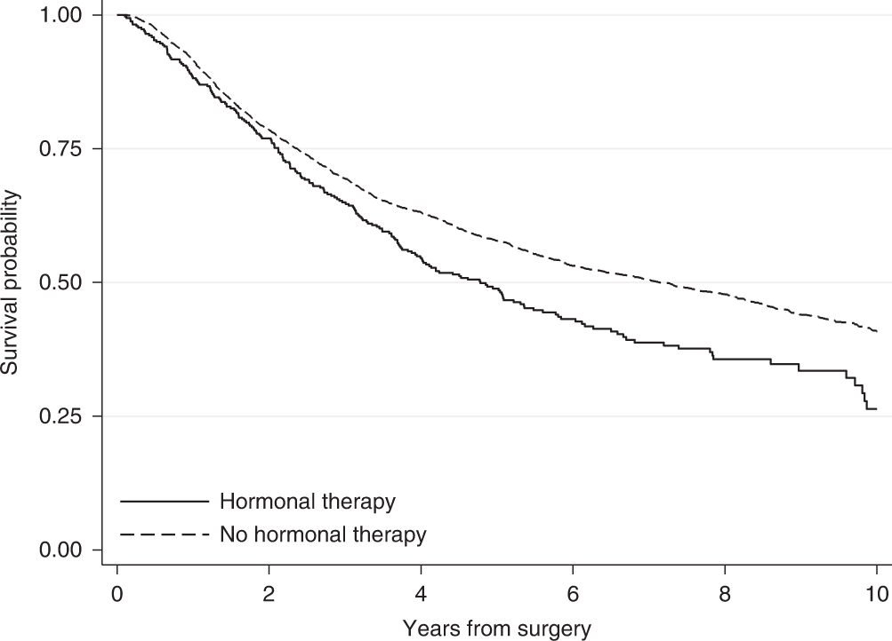

# (PART) Part III: Survival data {-}


# Working with time-to-event data 

A data type that is commonly found in clinical trials is **time to event data**. This type of data deals with the amount of time that elapses before a particular event happens. As a sub-field of statistics, survival analysis has been around for a long time, as people have thought about and worked data like mortality records ([most notably John Graunt, who used the 'Bills of Mortality' during the 1600s to better understand the plague and other causes of death](https://rss.onlinelibrary.wiley.com/doi/full/10.1111/1740-9713.01421)). However, it developed rapidly during the many cancer related clinical trials of the 1960s and 1970s. In these cases, the event in question was very often death, and which is why this branch of statistics came to be known as **survival analysis**. However, the event can be many other things, and indeed can be a positive outcome (for example being cured of some condition). Time-to-event data also appears in other applications, such as engineering (eg. monitoring the reliability of a machine) and marketing (eg. thinking of the time-to-purchase). As well as the books already mentioned, this chapter makes use of @collett_surv.

Usually, survival data is given in terms of time, but it can also be the number of times something happens (for example, the number of clinic appointments attended) before the event in question occurs.

Survival data is trickier to handle than the data types we have seen so far, for two main reasons. Firstly (and simply) survival data is very often skewed, so even though it is (usually) continuous, we can't just treat it as normally distributed. Secondly (and more complicatedly, if that's a word) with time-to-event data we don't usually observe the full dataset. 

## Censored times 

If a trial monitors a sample of participants for some length of time, many will experience the event before the trial is finished. However, for some of the sample we likely won't observe the event. This could be because it doesn't happen within the lifetime of the trial, or it could be because the participant exits the trial prematurely for some reason (eg. withdrawal), or simply stops attending follow-up appointments after a certain times. For these participants, we do know that they had not experienced the event up to some time $t$, but we don't know what happened next. All we know is that their time-to-event or **survival time** is greater than that time $t$. These partial observations are known as **censored** times, and in particular as **right-censored** times, because the event happens *after* the censored time. It is possible (but less common) to have *left-censored* or *interval-censored* data, but in this course we will deal only with right-censoring.

```{r censor, fig.cap = "An example of some censored data."}
df_cens = data.frame(
  id = as.factor(1:10),
  out = c(8,7,6,12,12,3,4,3,8,7),
  Type = as.factor(c("Event","Event","Censored", "Censored", "Censored", "Censored", "Censored", "Censored","Event","Censored"))
)

ggplot(data=df_cens) + 
  geom_segment(aes(x=0, xend=out, y=id, yend=id)) + 
  geom_point(aes(x=out, y=id, pch=Type, col=Type), size=4) +
  ylab("Participant") +
  geom_vline(xintercept=10, lty=2) +
  xlab("Time") +
  theme_bw()

```

If we were to treat censored times as observations, ie. as though the event had happened at time $t$, we would bias the results of the trial very seriously. The survival times reported would be systematically shorter than the true ones. For example, in the dataset shown in Figure \@ref(fig:censor), we would estimate the survival probability at time 10 as 0.2, since only two of the 10 participants were still in the trial after time 10. But it may well be that some of the participants whose observations were censored before $t=10$ were still alive at $t=10$.

If we were to remove the censored times, and only analyse the data in which the event was observed during the linespan of the trial, we would be losing data and therefore valuable information. This approach may well also lead to bias, for example if some subset of patients died quite soon into the trial, but the remainder lived a long time (past the end of the trial). If our analysis ignores the survivors, we are likely to underestimate the general survival time. In the dataset in Figure \@ref(fig:censor) there are five participants (3,6,7,8,10) whom we are no longer able to observe at time 10, but of whom none had experienced the event by the point at which they were censored.

So we know that we need to somehow include these censored times in our analysis. How we do so will depend on our approach.

## The Survival Curve and the Hazard function {#survhaz}

The field of survival analysis is relatively unusual in statistics, in that it isn't treated predominantly parametrically. For most continuous data, it is overwhelmingly common to work with the normal distribution and its friends (eg. the student's t distribution). Similarly binary data is dominated by the binomial distribution. Inference is therefore often focussed on the parameters $\mu,\;\sigma$ or $p$, as an adequate summary of the truth given whatever parameteric assumption has been made. 

However, in survival analysis, it is often the case that we focus on the whole shape of the data; there isn't an accepted dominating probability distribution. In order to be able to deal with time-to-event data, we need to introduce some key ways of working with such data. 

The **survival time** (or time-to-event) $t$ for a particular individual can be thought of as the value of a random variable $T$, which can take any non-negative value. We can think in terms of a probability distribution over the range of $T$. If $T$ has a probability distribution with underlying *probability density function* $f\left(t\right)$, then the *cumulative distribution function* is given by

$$F\left(t\right) = P\left(T<t\right) = \int\limits_0^t f\left(u\right)du, $$
and this gives us the probability that the survival time is less than $t$.

:::{.definition}
The **survival function**, $\operatorname{S}\left(t\right)$, is the probability that some individual (in our context a participant) survives longer than time $t$. Therefore $\operatorname{S}\left(t\right) = 1 - F(t)$. 
Conventionally we plot $\operatorname{S}\left(t\right)$ against $t$ and this gives us a **survival curve**.
:::

We can immediately say two things about survival curves:

  1. Since all participants must be alive (or equivalent) at the start of the trial, $\operatorname{S}\left(0\right)=1$.
  2. Since it's impossible to survive past $t_2>t_1$ but not past time $t_1$, we must have  $\frac{d\operatorname{S}\left(t\right)}{dt}\leq{0}$, ie. $\operatorname{S}\left(t\right)$ is non-increasing.
  
Figure \@ref(fig:egsurvival) shows two survival curves, comparing different therapies. We see that the hormonal therapy reduces the survival time slightly compared to no hormonal therapy.  
  
```{r egsurvival, fig.cap = "An example of two survival curves, taken from @syriopoulou2022standardised."}

```

Following on from the survival function, we have another (slightly less intuitive) quantity: the **Hazard function** $h\left(t\right)$.

:::{.definition}
The **Hazard function** $h(t)$ is the probability that an individual who has survived up to time $t$ fails just after time $t$; in other words, the instantaneous probability of death (or *experiencing the event*) at time $t$.
:::

If we use $T$ to denote the random variable of survival time (or time-to-event) then $\operatorname{S}\left(t\right)$ and $h(t)$ are defined by

$$
\begin{aligned}
\operatorname{S}\left(t\right)&= \operatorname{Pr}\left(T>t\right)\\
h\left(t\right) & = \lim\limits_{s\rightarrow{0+}}\frac{\operatorname{Pr}\left(t<T<t+s\mid{T>t}\right)}{s}.
\end{aligned}
$$
Using the definition of conditional probability, we can rewrite $h(t)$ as 

$$
\begin{aligned}
h\left(t\right) & = \lim\limits_{s\rightarrow{0+}}\frac{\operatorname{Pr}\left(t<T<t+s\mid{T>t}\right)}{s} \\
 & = \lim\limits_{s\rightarrow{0+}}\left[\frac{1}{\operatorname{Pr}\left(T>t\right)}\cdot\frac{\operatorname{Pr}\left(\left(t<T<t+s\right)\cap\left(T>t\right)\right)}{s}\right] \\
 & = \lim\limits_{s\rightarrow{0+}}\left[\frac{1}{\operatorname{Pr}\left(T>t\right)}\cdot\frac{\operatorname{Pr}\left(t<T<t+s\right)}{s}\right]\\
 & = \frac{f\left(t\right)}{\operatorname{S}\left(t\right)},
\end{aligned}
$$
where $f\left(\cdot\right)$ is the probability density of $T$. The hazard function can take any positive value (unlike the survival function), and for this reason $\log\left(h\left(t\right)\right)$ is often used to transform it to the real line. The hazard function can also be called the 'hazard rate', the 'instantaneous death rate', the 'intensity rate' or the 'force of mortality'.

As we hinted before, there are fundamentally two ways to deal with survival data: we can go about things either parametrically or non-parametrically. Unusually for statistics in general, the non-parametric paradigm is prevalent in survival analysis. We will consider some methods from both paradigms.

### The Kaplan-Meier estimator

The **Kaplan-Meier estimator** is a non-parametric estimate of $\operatorname{S}\left(t\right)$, originally presented in @kaplan1958nonparametric. The idea behind it is to divide the interval $\left[0,\;t\right]$ into many short consecutive intervals,

$$\left[0,\,t\right] = \bigcup\limits_{k=0}^K \left[s_k,\,s_{k+1}\right],$$
where $s_k<s_{k+1}\;\forall{k}$, $s_0=0$ and $s_{K+1}=t$. We then estimate the probability of surviving past some time $t$ by multiplying together the probabilities of surviving the successive intervals up to time $t$. No distributional assumptions are made, and the probability of surviving interval $\left[s_k,\,s_{k+1}\right]$ is estimated by $1-Q$, where 

$$Q = \frac{\text{Number who die in that interval}}{\text{Number at risk of death in that interval}}.$$
More precisely, let's say that deaths are observed at times $t_1<t_2<\ldots < t_n$, and that the number of deaths at time $t_i$ is $d_i$ out of a possible $n_i$. Then for some time $t\in\left[t_J,\,t_{J+1}\right)$, the Kaplan-Meier estimate of $\operatorname{S}\left(t\right)$ is 

$$\hat{\operatorname{S}}\left(t\right) = \prod\limits_{j=0}^J \frac{\left(n_j - d_j\right)}{n_j}.$$

Notice that the number of people at risk at time $t_{j+1}$, $n_{j+1}$, will be the number of people at risk at time $t_j$ (which was $n_j$), minus any who died at time $t_j$ (which we write as $d_j$) and any who were censored in the interval $\left[t_j,\,t_{j+1}\right)$. In this way, the Kaplan-Meier estimator incorporates information from individuals with censored survival times up to the point they were censored.

:::{.example #surveg1}
@edmonson1979prognosis conducted a trial on patients with advanced ovarian cancer, comparing cyclophosphamide (group $C$) with a mixture of cyclophosphamide and adriamycin (group $T$). Patients were monitored, and their time of death was recorded, or a censoring time if they were alive at their last observation.

```{r}
ov_df = ovarian[order(ovarian$futime),1:2]
names(ov_df) = c("FU_time", "FU_status")
knitr::kable(ov_df, caption = "Ovarian cancer data. FU time gives the survival or censoring time, and FU status the type: 0 for a censored observation, 1 for death.")
```


We see that there are 26 individuals, and we have the time of death for 12 of them. The remaining 14 observations are censored.
We can use this data to calculate the Kaplan-Meier estimator of the survival curve, as shown in the table below. The columns are (from left to right): time $t_j$; number at risk $n_j$; number of events/deaths $d_j$; number of censorings in $\left[t_{j-1},\,t_j\right)$; estimate of survival curve.

```{r}
surv_object <- Surv(time = ovarian$futime, event = ovarian$fustat)
fit_ov = survfit(surv_object ~ 1, data=ovarian)
sum_ovfit = summary(fit_ov)
ovfit_df = data.frame(
  time = sum_ovfit$time,
  n_risk = sum_ovfit$n.risk,
  n_event = sum_ovfit$n.event,
  n_cens = sum_ovfit$n.censor,
  survival = sum_ovfit$surv
)

kable(ovfit_df, caption = "Kaplan-Meier estimator calculations for ovarian cancer dataset.")%>%kableExtra::column_spec(c(1,5), bold = TRUE)

```

To demonstrate the effect of including (and correctly treating) the censored data, we can do the same thing, but this time (1) leaving out all censored data and (2) treating all censored data times as deaths. Figure \@ref(fig:kmov) shows the resulting survival curve estimates.

```{r kmov, fig.cap = "Kaplan-Meier estimate of survival curve for ovarian cancer data, with two incorrect estiamtes also shown."}
ov_err1 = ovarian[ovarian$fustat==1,]
ov_err1$fustat = rep(1,12)
surv_err1 <- Surv(time = ov_err1$futime, event = ov_err1$fustat)
fit_ov_err1 = survfit(surv_err1 ~ 1, data=ov_err1)
sum_err1 = summary(fit_ov_err1)


ov_err2 = ovarian
ov_err2$fustat = rep(1,26)
surv_err2 <- Surv(time = ov_err2$futime, event = ov_err2$fustat)
fit_ov_err2 = survfit(surv_err2 ~ 1, data=ov_err2)
sum_err2 = summary(fit_ov_err2)

df_good = data.frame(
  time = sum_ovfit$time,
  surv = sum_ovfit$surv,
  Method = "Kaplan-Meier"
)
df_err1 = data.frame(
  time = sum_err1$time,
  surv = sum_err1$surv,
  Method = "Leave out censored (1)"
)

df_err2 = data.frame(
  time = sum_err2$time,
  surv = sum_err2$surv,
  Method = "Censored as death (2)"
)

df_ov_full = rbind(df_good, df_err1, df_err2)
df_ov_full$Method = as.factor(df_ov_full$Method)

ggplot(data = df_ov_full, aes(x=time, y=surv, col = Method, lty = Method)) + geom_step() +
  theme_bw() + xlab("Time") + ylab("Survival curve") +theme(legend.position = "bottom")

```
Leaving out the censored observations entirely is the most problematic approach, since it causes a serious underestimate, and in this case behaves as though there are no survivors after $t=638$, which is untrue. Treating the censored data as deaths also leads to an underestimate of the survival probability, and notably creates a rather spurious curve past the last real death observation.

The 'correct' Kaplan-Meier estimate may seem a bit disatisfying, since it stops at $t=638$ with a probabiilty of $0.497$. However, this is really (in a non-parametric setting) all we can say with the data available; 10 of the participants were definitely still alive at $t=638$, and some of the other censored participants may also have been.

:::


For a clinical trial, we want to plot the survival curves separately for the different treatment groups. This will give a first, visual, idea of whether there might be a difference, and also of the suitability of certain models (we'll talk about this later).

:::{.example #veteranmyeloid}

Figure \@ref(fig:ovarian) shows the Kaplan Meier plots for the ovarian cancer data from Figure \@ref(fig:kmov), this time split by treatment group.

```{r ovarian, fig.cap = "Kaplan Meier curves for the ovarian cancer data, split by treatment. Red is for group T (mixture of cyclophosphamide and adriamycin), black for group C (cyclophosphamide only)."}

s_ov = with(ovarian, Surv(futime, fustat))
ov_km_fit <- survfit(Surv(futime, fustat)~rx, data=ovarian)
plot(ov_km_fit, xlab="Time", ylab = "S(t)", col=c(1,2))

```


The second dataset we will use throughout this chapter has been simulated based on a trial of acute myeloid leukemia (@le2018application) and is from the `survival` package @survival-package.

```{r myeloid, fig.cap = "Kaplan Meier curves for the Myeloid data, split by treatment. Red is for group T, black for group C (placebo)."}
s_my = with(myeloid, Surv(futime, death))
my_km_fit <- survfit(Surv(futime, death)~trt, data=myeloid)
plot(my_km_fit, xlab="Time", ylab = "S(t)", col=c(1,2))
```


:::


### A parametric approach

In a parametric approach, we'll assume that the survival time $T$ follows some probability distribution, up to unknown parameters which we will estimate from the data. The simplest distribution for time-to-event data is the *exponential distribution*, which has density

$$f\left(t\right) = \lambda e^{-\lambda t} \text{ for }t>0,$$

survival function 

$$\operatorname{S}\left(t\right) = 1- \int\limits_{0}^t{\lambda e^{-\lambda t}} = e^{-\lambda t}, $$
and mean survival time $\frac{1}{\lambda}$. The hazard function is therefore

$$h\left(t\right) = \frac{f\left(t\right)}{S\left(t\right)} = \lambda, $$
that is, the hazard is constant.


#### Maximum likelihood for time-to-event data {#expll}

Suppose our dataset has $n$ times $t_1,\,t_2,\,\ldots,t_n$. Of these, $m$ are fully observed and $n-m$ are censored. We can create a set of indicators $\delta_1,\ldots,\delta_n$, where $\delta_i=1$ if observation $i$ is fully observed and $\delta_i=0$ if it is censored. 

Usually, the likelihood function is computed by multiplying the density function evaluated at each data point, $f\left(t_i\right)$. However, this won't work for survival data, because for our censored times (those for which $\delta_i=0$) we only know that the time-to-event is greater than $t_i$. For these observations, it is the survival time (remember that this is $p\left(T>t\right)$) that contributes what we need to the likelihood function.

Therefore (for either probability distribution) we have

$$L = \prod\limits_{i=1}^n f\left(t_i\right)^\delta_i S\left(t_i\right)^{1-\delta_i}.$$
If we have $T\sim Exp\left(\lambda\right)$ then the log-likelihood is

$$
\begin{aligned}
\ell &= \sum\limits_{i=1}^n \delta_i\left(\log\lambda - \lambda t_i\right) - \sum\limits_{i=1}^n\left(1-\delta_i\right)\lambda t_i \\
& =  m\log\lambda - \lambda\sum\limits_{i=1}^n t_i. 
\end{aligned}
$$

From this we can find the maximum likelihood estimator (MLE)

$$\hat{\lambda} = \frac{m}{\sum\limits_{i=1}^n t_i}.$$
The variance of the MLE is

\begin{equation}
\operatorname{var}\left(\hat\lambda\right) = \frac{\lambda^2}{m},
(\#eq:lambdavar)
\end{equation}

which we can approximate by 

$$\operatorname{var}\left(\hat\lambda\right) \approx \frac{m}{\left(\sum\limits_{i=1}^n t_i\right)^2}.$$

Notice that the numerator in Equation \@ref(eq:lambdavar) is $m$, the number of complete observations (rather than $n$ the total number including censored observations). This shows that there is a limit to the amount we can learn if a lot of the data is censored. 

### Aside: Sample size calculations for time-to-event data {-}

There are implications here for sample size calculations, which must take into account the duration of a trial; it is important that trials monitor patients until a sufficient proportion have experienced the event (whatever it is). Sample size calculations for time-to-event data therefore have two components:

  1. The power of the trial can first be expressed in terms of $m$, the number of complete observations.
  2. A separate calculation is needed to estimate the number of participants needing to be recruited, and length of trial, to be sufficiently likely to achieve that value of $m$.
  
Both of these calculations rely on a number of modelling assumptions, and on previous scientific/clinical data (if available).

:::{.example}
Returning to the dataset from Example \@ref(exm:surveg1), we can fit an exponential distribution to the data simply by estimating the MLE 

$$ 
\begin{aligned}
\hat{\lambda}_C &= \frac{m_C}{\sum\limits_{i=1}^{n_C} t_i}\\
& =\frac{7}{6725}\\
& = 0.00104
\end{aligned}
$$
and

$$ 
\begin{aligned}
\hat{\lambda}_T &= \frac{m_T}{\sum\limits_{i=1}^{n_T} t_i}\\
& =\frac{5}{8863}\\
& = 0.00056
\end{aligned}
$$

```{r, echo=T}
mC_ov = sum((ovarian$fustat==1)&(ovarian$rx==1))
mT_ov = sum((ovarian$fustat==1)&(ovarian$rx==2))
tsum_ov_C = sum(ovarian$futime[ovarian$rx==1])
tsum_ov_T = sum(ovarian$futime[ovarian$rx==2])
m_ov = mT_ov + mC_ov
tsum_ov = tsum_ov_C + tsum_ov_T
lamhat_ov_C = mC_ov / tsum_ov_C
lamhat_ov_T = mT_ov / tsum_ov_T
```

```{r expov, fig.cap = "Kaplan Meier estimates of survival curves for the ovarian data (solid lines), with the fitted exponential S(t) shown in dashed lines (red = group T, black = group C)."}
plot(ov_km_fit, xlab="Time", ylab = "S(t)", col=c(1,2))

xvec = 1:2500
svec_ov_C = exp(-lamhat_ov_C*xvec)
svec_ov_T = exp(-lamhat_ov_T*xvec)

lines(xvec, svec_ov_C , type = "l", col=1, lty=2)
lines(xvec, svec_ov_T , type = "l", col=2, lty=2)

```

:::

We will think more about how this can be used in the next section, when we come to compare treatment effects.

