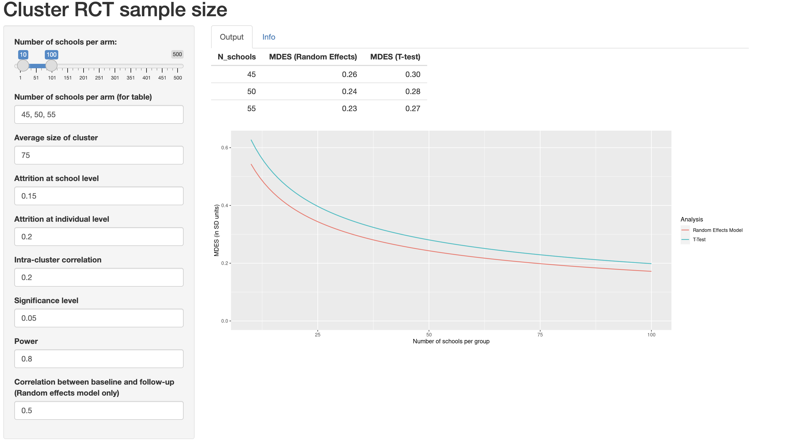

# (PART) Part III: Further designs {-}

 

# Cluster randomised controlled trials {#cluster-rct}

For the trials we've been studying so far, the intervention is applied at an individual level. For many treatments this is realistic, for example a medicine, injection or operation. However, for some treatments this is not practical. One example would be implementing a new cleaning regime in operating theatres. It would be almost impossible to implement this if different patients within the same hospital would be allocated to different cleaning styles. Logistically it would be very difficult, and there would likely be contamination as staff may be reluctant to clean an operating theatre in what might now seem an inferior way, for a control participant. In general it is very difficult (if not impossible) to implement changes in practice across healthcare systems at an individual level. 

The solution to this is to work at the group level, rather than the individual level.

## What is a cluster RCT?

In a cluster RCT, participants within the same natural group (eg. doctor's surgery, hospital, school, classroom,...) are all allocated to the same group together. This means that, in the cleaning example above, the staff at a hospital in the treatment group can be trained in the new practice, all patients at that hospital will 'receive the new treatment', and contamination between groups is minimised.

The main issue that makes cluster RCTs different is that participants within the same group are often likely to be more similar than those in a different group. We expect that each group has its own 'true' mean, which is different from the underlying population mean. This violates one of the key assumptions we've held so far, that the data are independent, and leads us to a very important quantity called the **intracluster correlation** (ICC).

### Intracluster correlation

The ICC quantifies the relatedness of data that are clustered in groups by comparing the variance within groups by the variance between groups. The ICC is given by

$$ICC = \frac{\sigma^2_b}{\sigma^2_b + \sigma^2_w}, $$
where $\sigma^2_b$ is the variance **between** groups and $\sigma^2_w$ is the variance **within** groups. At one extreme, where $\sigma_w^2=0$, we have $ICC=1$ and all measurements within each group are the same. At the other extreme, where $\sigma^2_b=0$, $ICC=0$ and in fact all groups are independent and identically distributed.

We can estimate $\sigma_w^2$ and $\sigma_b^2$ using $s_w^2$ and $s_b^2$, which we find by decomposing the pooled variance. Here, $g$ is the number of groups, $n_j$ is the number of participants in group $j$ and $n$ is the total number of participants.


$$
s^2_{Tot} =  \frac{\sum\limits_{j=1}^g \sum\limits_{i=1}^{n_j}\left(x_{ij}-\bar{x}\right)^2}{n-g}\\
$$
We can split this up as

$$
\begin{aligned}
s^2_{Tot} & = \frac{1}{n-g}\sum\limits_{j=1}^g \sum\limits_{i=1}^{n_j}\left(x_{ij} - \bar{x}_j + \bar{x}_j-\bar{x}\right)^2\\
& = \frac{1}{n-g}\sum\limits_{j=1}^g \sum\limits_{i=1}^{n_j}\left[\left(x_{ij} - \bar{x}_j\right)^2 + \left(\bar{x}_j-\bar{x}\right)^2 + 2\left(x_{ij} - \bar{x}_j\right)\left(\bar{x}_j-\bar{x}\right)\right]\\
& = \frac{1}{n-g}\sum\limits_{j=1}^g \sum\limits_{i=1}^{n_j}\left[\left(x_{ij} - \bar{x}_j\right)^2 + \left(\bar{x}_j-\bar{x}\right)^2 \right]\\
&= \underbrace{\frac{1}{n-g}\sum\limits_{j=1}^g \sum\limits_{i=1}^{n_j}\left(x_{ij} - \bar{x}_j\right)^2}_{\text{Within groups}} + \underbrace{\frac{1}{n-g}\sum\limits_{j=1}^g n_j\left(\bar{x}_j - \bar{x}\right)^2}_{\text{Between groups}}
\end{aligned}
$$

:::{.example}
We will demonstrate the ICC using some familiar datasets (having nothing to do with clinical trials!). Firstly the `iris` data, which you may remember is in three distinct groups, grouped by `Species`. The data are plotted in Figure \@ref(fig:iris)

```{r iris, fig.cap = "Sepal length and width from Iris data, coloured by Species"}
data(iris)
ggplot(data=iris, aes(x=Sepal.Length, y=Sepal.Width, col = Species)) + geom_point()
```

We can estimate the within and between variances, and therefore the ICC, for any of the numeric variables. We will choose `Sepal.Length`. It is clear just from looking at the plot that a lot of variation is explained by the species, and we see below that $ICC=0.$

```{r, echo=T}

# Firstly we define functions for the estimates
between.var = function(
    data,
    groupvec
){
  groups = levels(as.factor(groupvec))
  ng = length(groups)
  ntot = length(data)
  
  
  means = sapply(1:ng, function(i){mean(data[groupvec == groups[i]])})
  njvec = sapply(1:ng, function(i){length(data[groupvec == groups[i]])})
  mean = mean(data)
  ssqvec = sapply(1:ng, function(i){(njvec[i]*(means[i]-mean)^2)})
  sum(ssqvec)/(ntot-ng)
}

within.var = function(
    data,
    groupvec
){
  groups = levels(as.factor(groupvec))
  ng = length(groups)
  ntot = length(data)
  
  means = sapply(1:ng, function(i){mean(data[groupvec == groups[i]])})
  njvec = sapply(1:ng, function(i){length(data[groupvec == groups[i]])})


  g_sums = rep(NA, ng)
  
  for (j in 1:ng){
    data_j = data[groupvec == groups[j]]
    ssqvec = rep(NA, njvec[j])
    for (i in 1:njvec[j]){
      ssqvec[i] = (data_j[i] - means[j])^2
    }
    g_sums[j] = sum(ssqvec)/(ntot - ng)
  }
  sum(g_sums)
}

## Now we can calculate them

bvar = between.var(iris$Sepal.Length, iris$Species)
bvar
wvar = within.var(iris$Sepal.Length, iris$Species)
wvar

## And find the ICC:

icc = bvar/(bvar+wvar)
icc
```
:::


:::{.example}

Our second example

```{r, echo=T}
cheese = read.csv("kroger.csv", header=T)
cheese$city = as.factor(cheese$city)
ggplot(data=cheese, aes(x=price, y=vol, col=city)) + geom_point()

wv_price = within.var(cheese$price, cheese$city)
bv_price = between.var(cheese$price, cheese$city)
icc = bv_price / (bv_price + wv_price)
icc
```
:::

We can see that for each district we know a fair amount about the cost of cheese. But, if we had to predict the price of cheese in a new city, for which we have no data, we would have no idea what the mean for that city would be, apart from that it would come from $N\left(\mu,\;\sigma^2_b\right)$, where $\mu$ is the mean price of cheese in the overall population and $\sigma^2_b$ is the between group variance.

Estimating the ICC when planning a study is an important step, but isn't always easy. For a well-understood (or at least well-documented) condition, it can often be estimated from existing data, which is likely to cover many sites. In non-medical studies like education or social interventions (where cluster RCTs are very common), it can be much more difficult because there is generally less data. Statistical studies are much newer in these areas, though they are becoming increasingly common, and even mandated by some organisations (for example the [Educational Endowment Foundation](https://educationendowmentfoundation.org.uk)).

**FIND ARTICLE ABOUT ESTIMATING ICC**

## Designing a cluster RCT

### Sample size

The upshot of the non-independence of the sample is that we have less information from $n$ participants in a cluster RCT than we would do for an individual-based RCT where all the participants were independent (at least conditional on some covariates). 

At one extreme, where ICC=0, there is in fact no intracluster correlation, all the groups have the same mean, and this is the same as a normal RCT. At the other extreme, where ICC=1, all measurements within a cluster are identical, and to achieve the same power as with $n$ particpants in a standard RCT, we would need $n$ clusters (and their size would be irrelevant). Obviously neither of these is ever true! In most studies, the ICC is in $\left(0,\;0.15\right)$.
 
We will work through the sample size (and indeed most other things) for a cluster RCT in which the outcome is continuous (as in Chapter \@ref(rct-plan)), but you can equally do a cluster RCT with a binary or time-to-event outcome. 

The first step is to think about how the clustering affectst the variance. An estimate of the outcome variance in the control group, ignoring the clustering, is

\begin{equation}
\hat{\sigma}^2 = \frac{\sum\limits_{j=1}^g\sum\limits_{i=1}^{n_j}\left(X_{ij} - \bar{X}\right)^2}{n-1},
(#eq:varcrt1)
\end{equation}

where as before there are $g$ clusters, cluster $j$ has size $n_j$ and $\sum\limits_{j=1}^gn_j=n$ is the total sample size.

The mean is also calculated without reference to the clustering, so

$$\bar{X} =  \frac{\sum\limits_{j=1}^g\sum\limits_{i=1}^{n_j}X_{ij}}{n}.$$
Assuming the clusters are independent, we can find expectations of Equation \@ref(eq:varcrt1)

$$
\begin{aligned}
E\left[\left(n-1\right)\hat{\sigma}^2\right]&= n\sigma^2 - \frac{1}{n}E\left[\left(\sum\limits_{j=1}^g\sum\limits_{i=1}^{n_j}\left[X_{ij} - E\left(X_{ij}\right)\right]\right)^2\right] \\
&=n\sigma^2 - \frac{1}{n}\operatorname{var}\left(\sum\limits_{j=1}^g T_j\right)\\
& = n\sigma^2 - \frac{1}{n}\sum\limits_{j=1}^g\operatorname{var}\left(T_j\right)
\end{aligned},
$$
where $T_j = \sum\limits_{i=1}^{n_j}X_{ij}$ is the sum of responses in cluster $j$. The variance of $T_j$ can therefore be calculated as

$$
\begin{aligned}
\operatorname{var}\left(T_j\right) & = \sum\limits_{i=1}^{n_j} \operatorname{var}\left(X_{ij}\right) + \sum\limits_{i\neq{l}}\operatorname{cov}\left(X_i,\,X_l\right)\\
& = n_j \sigma^2 + n_j \left(n_j-1\right)\rho\sigma^2.
\end{aligned}
$$
and so the expected value of Equation \@ref(eq:varcrt1) is $\sigma^2\left(1-C\rho\right)$, where

$$C = \frac{\sum\limits_{j=1}^g n_j\left(n_j-1\right)}{n\left(n-1\right)}.$$
Notice that if all the groups are the same size $n_g = \frac{n}{g}$ then this simplifies to 

$$C = n\left(n_g - 1\right).$$
We will assume from now on that this is the case.

#### A formula for sample size {#ss-crt}

Now that we know $\operatorname{E}\left(\hat{\sigma}^2\right)$ we can adapt our sample size formula from Section \@ref(sec-ssformulacont). For an individual-level RCT with a continuous outcome, we had

\begin{equation}
n = \frac{2\sigma^2\left(z_{\beta} + z_{\alpha/2}\right)^2}{\tau^2_M}, 
(\#eq:ss1)
\end{equation}

and the reason we were able to do this was because the variance of the treatment mean was $\sigma^2/n$. 
For a cluster RCT, the variance of the treatment effect is 

\begin{equation}
\frac{\sigma^2}{n} \left[1 + \rho\left(\frac{\sum\limits_{j=1}^g n_j}{n}-1\right)\right]
(\#eq:varte1)
\end{equation}

At the planning stage of a cluster RCT we are unlikely to know the size of each cluster; each individual involved will usually need to give their consent, so knowing the size of the hospital / GP surgery / class is not enough. Instead, usually a [conservative] average cluster size $n_g$ is specified, and this is used. In this case, the variance of the treatment effect in Equation \@ref(eq:varte1) becomes

\begin{equation}
\frac{\sigma^2}{n} \left[1 + \rho\left(n_g-1\right)\right] .
(\#eq:varte2)
\end{equation}

Equation \@ref(eq:varte2) can be combined with Equation \@ref(eq:ss1) to give the sample size formula for a cluster RCT:

$$n = \frac{2\sigma^2\left[1 + \rho\left(n_g-1\right)\right]\left(z_{\beta} + z_{\alpha/2}\right)^2}{\tau^2_M}.
 $$
 Since $n=n_gg$, this can be rearranged to find the number of clusters of a given size needed, or the size of cluster if a given numnber of clusters is to be used.
 
 The sample size (and therefore the real power of the study) depends on two additional quantites that are generally beyond our control, and possibly knowledge: ICC and $n_g$. It is therefore sensible to conduct some sensitivity analysis, with several scenarios of ICC and $n_g$, to see what the implications are for the power of the study if things don't quite go to plan.
 
:::{.example}
This is something I wrote for an education study I'm involved in (funded by the EEF) where the treatment is a particular way of engaging 2 year olds in conversation. The outcome variable is each child's score on the British Picture Vocabulary Scale (BPVS), a test aimed at 3 - 16 year olds designed to assess each child's vocabulary. We needed to recruit some number of nurseries, but had very little information about the IIC (notice that the age in our study is outside the intended range of the BPVS test!). 

To help the rest of the evaluation team understand the sensitivity of the power of the study to various quantities, I designed [this dashboard](https://racheloughton.shinyapps.io/sample_size/), so that they could play around with the variables and see the effect.

As well as giving the sample size for a simple t-test (as we've done above) it also shows the size for a random effects model (similar to ANCOVA, more on this soon), which is why the baseline-outcome correlation (about which we also know very little!) is included.

The plot shows the minimum detectable effect size (MDES, or $\tau_M$, in SD units), since the evaluation team wanted to know what size of effect we could find with our desired power.


```{r}


```

:::

### Allocation

In a cluster RCT, everyone within a particular cluster will be in the same group ($T$ or $C$). Therefore, the allocation needs to be performed at the cluster level, rather than at the individual level as we did in Chapter \@ref(alloc). 

In theory we could use any of the first few methods we learned (simple random sampling, random permuted blocks, biased coin, urn design) to allocate the clusters. However, there are often relatively few clusters, and so the potential for imbalance in terms of the nature of the clusters would be rather high. This means we are more likely to use a stratified method or minimisation. 

In terms of prognostic factors, there are now two levels: cluster level and individual level. For example, in a study with GP practices as clusters, some cluster-level covariates could be the size of the practice, whether it was rural or urban, the IMB (index of mass deprivation) of the area it was in. It would be sensible to make sure there was balance in each of these in the allocation. One might also include aggregates of individual-level characteristics, for example the mean age, or the proportion of people with a particular condition (especially if the study relates to a particular condition).

However, a key feature of cluster RCTs means that in fact some different, and perhaps more effective, allocation methods are open to us.

## Allocating everyone at once

The methods we've covered so far assume that participants are recruited sequentially, and begin the intervention at different points in time. In this scenario, when a particular participant (participant $n$) is allocated we only know the allocation for the previous $n-1$ participants. It is very likely that we don't know the details of the following participants, in particular their values of any prognostic variables. This makes sense in many medical settings, where a patient would want to begin treatment as soon as possible, and there may be a limited number of patients with particular criteria at any one time.

However, cluster RCTs rarely deal with urgent conditions (at least in the sense of administering a direct treatment), and so the procedure is usually that the settings (the clusters) are recruited over some recruitment period and all begin the intervention at the same time. This means that at the point of allocation, the details of all settings involved are known.
There are a couple of proposals for how to deal with allocation in this scenario, and we will look at one now. 

### Covariate constrained randomization

This method is proposed in @dickinson2015pragmatic, and implemented in the R package `cvcrand`. We'll review the key points of the method, but if you're interested you can find the details in the article.

Baseline information must be available for all settings, for any covariate thought to be potentially important. These can be setting-level variables or aggregates of individual-level variables. Once all this data has been collected, the randomisation procedure is as follows.

Firstly, generate all possible allocations of the clusters into two arms ($T$ and $C$). 

Secondly, rule out all allocations that don't achieve the desired balance criteria. 

For a categorical covariate, the procedure is very simple. For example, we may stipulate that we want groups $T$ and $C$ to have the same number of rural GP practices as one another. In this case, we would remove from our set of possible allocations any where the numnber was different, or perhaps where it differed by more than some number $d_{rural}$. We continue for all the covariates we want to balance, setting rules for each one.

Continous covariates are standardized and used to calculate a 'balance score' $B$ for each of the remaining allocations. A cut-off is used to rule out all allocations that don't achieve the desired level of balance. This leaves an 'optimal set' of allocations.

Finally, an allocation is chosen at random from the optimal set, and this is the allocation that is used.


### Restricted randomization

READ UP ON THIS!
https://cran.r-project.org/web/packages/cvcrand/vignettes/cvcrand.html

https://clusterrandomisedtrials.qmul.ac.uk/parallel-crts/


## Analysing a cluster RCT

As with the other stages of a cluster RCT, to conduct an effective and accurate analysis we need to take into account the clustered nature of the data. There are several ways to do this, and we will whizz through the main ones now.

:::{.example}
The data we use will be from an educational trial, contained in `crtData` in the package `eefAnalytics`. The dataset contains 22 schools and 265 pupils in total. Each school was assigned to either `1` (group $T$) or `0` (group $C$). Each pupil took a test before the trial, and again at the end of the trial. We also know the percentage attendance for each pupil. We will use this data to demonstrate each method.

```{r}
crt_df = crtData[ ,-6]
paged_table(crt_df)
```

:::

### At the cluster level

In cluster level analysis, the data is aggregated to the cluster level, so that for each cluster (school, in our  case), there is effectively one data point. The advantage of this approach is that, because the design is conducted at the cluster level, the statistical methodology is relatively simple - for example, a t-test. However, if cluster sizes vary a lot, a cluster-level analysis is often not appropriate because they usually rely on the assumption that the variance of the outcome in each cluster is approximately the same. As we have seen, the larger a group, the smaller the variance of its sample mean. There are methods designed to account for this, such as the weighted t-test, but these methods are generally inefficient and less robust. These methods are generally thought to be appropriate for fewer than 15-20 clusters per treatment arm.

One possibility for our trial would be to collect the mean and SD of scores within each school, and perform a t-test to find out if there is a significant difference between the intervention and control arms. If we wanted to find out whether this depended on, say, gender, we could split the data set and perform seperate t-tests for the different gender groups. This has the advantage that it is simple to implement, but the disadvantage that it is difficult to take into account covariates (apart from in the simple way discussed for eg. gender). With a small study, is likely that there is some imbalance in the design in terms of covariates.

The required sample size for this option would be

$$
g = \frac{2 \sigma^2 \left[1+ \left(n_g-1\right)\rho_{icc}\right]}{n_g\tau^2_M}\left(z_{\beta} + z_{\frac{1}{2}\alpha}\right)^2,
$$
where $n_g$ is the average cluster size and $g$ is the number of clusters per treatment arm. This is the value we worked out in Section \@ref(ss-crt)

:::{r}
We can perform this analysis on our schools data. The first step is to calculate the difference between `posttest` and `pretest` for each pupil.

```{r, echo=T}
crt_df$diff = crt_df$Posttest - crt_df$Prettest
```

We can then aggregate this to find the mean of `diff` for each school:

```{r, echo=T}
crt_summ = crt_df %>%
  group_by(School) %>%
  summarise(MeanDiff = mean(diff), ng = n(), Group = mean(Intervention))
crt_summ$Group = as.factor(crt_summ$Group)
paged_table(crt_summ)
```
We can also visualise the mean differences by group

```{r crt1bp, fig.cap = "Boxplots of the mean differences for each trial arm", fig.height=2}
ggplot(data=crt_summ, aes(x=MeanDiff, fill=Group)) + geom_boxplot()
```
From Figure \@ref(fig:crt1bp) it certainly looks likely that a significant difference will be found.

```{r, echo=T}
t.test(
  x=crt_summ$MeanDiff[crt_summ$Group==0],
  y=crt_summ$MeanDiff[crt_summ$Group==1],
  alternative = "two.sided",
  paired = F,
  var.equal=F
)
```
:::

This is fairly easy to implement, but it seems rather unsatisfactory. What we need is a linear (in the continuous outcome case at least) model that takes into account the covariates, and makes the most of the available data.

### At the individual level: Random effects models

TIDY THIS UP!!!

The random effects model takes the form 

\begin{equation}
x_{ijk} = \alpha + \beta_i + \sum\limits_l \gamma_l z_{ijkl} + u_{ij} + v_{ijk}
(\#eq:remodel)
\end{equation}

where

  * $x_{ijk}$ is the outcome for the $k$-th individual in the $j$-th cluster in the $i$-th treatment arm (usually $i=0$ is the control arm and $i=1$ is the intervention arm)
  * $\beta_i$ is the intervention effect (with $\beta_0=0$). Our null hypothesis is that $\beta_1$ is also zero)
  * The $z_{ijkl}$ are $L$ different individual level covariates that we wish to take into account, and the $\gamma_l$ are the estimated coefficients.
  * $u_{ij}$ is a random effect relating to the $j$-th cluster in the $i$-th treatment arm. This is the term that accounts for the between-cluster variation. We assume $u_{ij}$ is normally distributed with mean 0 and variance $\sigma^2_B$ (the between-cluster variance).
  * $v_{ijk}$ is a random effect relating to the $k$-th individual in the cluster (ie. an individual level random error term), assumed normally distributed with mean 0 and variance $\sigma^2_W$ (the within-cluster variance).

With a random effects model we can take into account the effects of individual-level covariates and also the clustered design of the data. Approximately, our sample size requirements are

$$
k = \frac{2 \sigma^2 \left[1+ \left(m-1\right)\rho_{icc}\right]\left(1-\rho^2\right) }{m\tau^2_M}\left(z_{\beta} + z_{\frac{1}{2}\alpha}\right)^2.
$$

This is the 'Random effects model' line in [the shiny dashboard](https://racheloughton.shinyapps.io/sample_size/?_ga=2.190583720.2013007057.1679308387-1261352122.1678702192).)

The random effects model is more suitable when there are more than around 15-20 clusters in each arm.

### Analysing for effect modification - Random effects model

In a random effects model, interaction terms can be built into the model specification in \@ref(eq:remodel). This works well for individual level covariates, but less well for cluster-level covariates, especially for a small number of clusters, because it relies on comparisons between the clusters.

This would be equivalent to

$$
x_{ijk} = \alpha + \beta_i + \sum\limits_l\left(\gamma_l z_{ijkl} + \lambda_l\beta_i z_{ijkl}\right)+ u_{ij} + v_{ijk},
$$

Where there is a coefficient $\lambda_l$ for each covariate $z_{\cdot l}$ that is only 'activated' if $\beta_i\neq0$ ie. for the intervention group. Therefore, significant values of $\lambda_l$ will give us an idea of interaction effects between individual-level covariates and the intervention. However, how reliable these estimates are depends on the balance of the design. In particular, if there is strong multicollinearity in the covariates (ie. if some individual level covariates are correlated in the design), the coefficients $\lambda_l$ are also strongly related to one another, and are therefore not easily interpretable.

**This method is not suitable for pair-matched datasets - or is it? p290! Additional fixed effects to account for th strata, if stratified**


```{r}
Dickinson_outcome # from cvcrand. Binary outcome cluster trial. Use a GLMM. Could work in a pinch!
```
