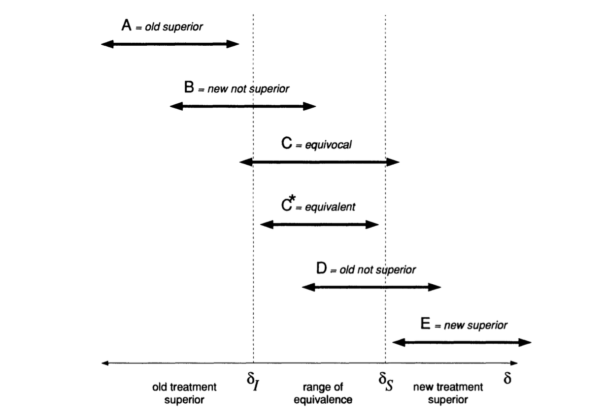

# The Bayesian Approach 

In this course we have taken a consistently frequentist approach. The reason for this is mainly pragmatic rather than ideological: the frequentist approach is by far the most commonly used way to design and analyse clinical trials, and some organisations won't even allow a Bayesian analysis.  

We aren't going to cover the whole Bayesian approach in one lecture, but we'll review some of the key differences, how the Bayesian approach to clinical trials works, and some advantages it has over frequentist methods (I'll try to keep my least biased hat on). Two excellent sources for this are @spiegelhalter1994bayesian (be warned this one is quite long, but the first sections alone are very useful) and @berry2006bayesian. We'll also illustrate the theory with some examples.

You'll have come across Bayesian methods at various points so far in other modules, but to varying extents, so we'll approach things from a fairly elementary level.

## The fundamental difference

First, we'll think a bit about exactly what's happening when we use a frequentist approach to analysing a clinical trial.

### The frequentist approach {-}

In the frequentist approach, we view the underlying parameters $\theta$, including for example the treatment effect (whatever form it takes), group means, correlations, variances and so on, as fixed quantities. We view the data $X$ as random, and as coming from some distribution governed by these fixed parameters. We might have different candidate values of these, most commonly a null hypothesis value of the treatment effect and an alternative hypothesis value.

This means that all the inferences we make are in terms of how likely or unlikely the data we observe ($\mathbf{x}$) are in terms of their having been generated by this distribution (usually in terms of the Null hypothesis distribution). We are led to quantities like

  * the $p$-value: the probability of seeing data at least this 'unusual' under $H_0$
  * $100\left(1-\alpha\right)\%$ confidence interval: the set of values of a parameter that cannot be rejected by a significance test performed at the $100\left(1-\alpha\right)\%$ level.
  * Maximum likelihood estimators, or likelihood ratio statistics: thinking in terms of which parameter values make the observed data $\mathbf{x}$ somehow *the most likely*
  
Clearly none of these allow us to make direct statements about the treatment effect $\tau$, for example the probability of it being within a certain range, or about any other parameter.

### The Bayesian approach {-}

In the notation of parameter(s) $\theta$ and data $\mathbf{x}$, Bayes theorem is

\begin{align*}
p\left(\theta\mid{\mathbf{x}}\right) &= \frac{p\left(\mathbf{x}\mid\theta\right)p\left(\theta\right)}{p\left(\mathbf{x}\right)}\\
&\propto p\left(\mathbf{x}\mid\theta\right)p\left(\theta\right).
\end{align*}

Notice that

  * $p\left(\mathbf{x}\mid\theta\right)$ is the **likelihood**, the same distribution we need in the frequentist approach
  * We also need to specify a **prior** distribution $p\left(\theta\right)$
  * We don't need to specify / find $p\left(\mathbf{x}\right)$ because it doesn't depend on $\theta$, and we can find the one constant value that makes the numerator a legitimate probability distribution (ie. integrates to one) by other means.
  
Above all, the most exciting thing is that we now have the **posterior** distribution, which is a probability distribution about the parameters $\theta$, and which therefore allows us to make direct inferences and probability statements about any parameter, including the treatment effect $\tau$. The Bayesian approach enables us to give a *direct answer* to the questions people actually ask, such as 'what's the probability the treatment effect is larger than 1?'

## Why is this important?

### Making probabilistic statements about the treatment effect {-}

Throughout this course we've thought in terms of a single null hypothesis where the treatment appears to have no better or worse effect on the participants than the control (generally we have $H_0:\; \tau=0$, though not always).
  
Really however, this is quite a simplistic breakdown of the scenario. In reality, it may be that in addition to the treatment effect in terms of the primary outcome, 

  * one drug has much worse or more common side effects
  * implementing the new treatment would be very expensive in terms of equipment, manufacture, training etc.

In this case, we might decide that the treatment effect has to be greater than some value $\tau_S$ to be considered clinically superior, and similarly that it has to be less than $\tau_I$ to be considered clinically inferior. This is linked to the idea of the minimum clinically important difference / minimum detectable effect size, except that in the Bayesian paradigm we have much more flexibility to consider other important values too.

We call the region $\left(\tau_I,\,\tau_S\right)$ the *range of equivalence*. Figure \@ref(fig:spieg-ranges), taken from @spiegelhalter1994bayesian, shows the clinically interesting possibilities for the treatment effect (our $\tau$, but $\delta$ in @spiegelhalter1994bayesian). Given a posterior distribution for $\tau$, we can calculate the probability of each of these outcomes. However that wouldn't be possible in a frequentist framework.


```{r spieg-ranges, fig.cap = "Possible clinically interesting ranges for the treatment effect."}

```

### Sequential analysis {-}

In a frequentist setting, the result of the analysis (a p-value or confidence interval, say), depends on the trial design, because not only are we thinking about the data we observed, but we also include the notion of "other more extreme outcomes". What these 'more extreme outcomes' are depends on how we've specified the trial design. 

For example, suppose we have a binary outcome $X$, which can be 1 or 0, with unknown (but fixed) parameter $\pi = p\left(X=1\right)$. We observe 10 realisations (in sequence) and find that our observed data are $0, 0, 1, 0, 0, 1, 0, 0, 0, 1$.  We will write $n_1=3,\,n_0=7$. What would have been a 'more extreme outcome' than this? 

This notion depends on two things:

  * The null value of $\pi$, which we'll call $\pi_0$ (so $H_0: \pi=\pi_0$)
  * The experimental design, and in particular the point at which we planned to stop making observations.
  
If our plan was to take 10 observations and record $n_1$, then 

  * for $\pi_0<0.3$, $n_1 > 3$ would be 'more extreme'.
  * for $\pi_0>0.3$, $n_1 = 0,1,2$ would all be 'more extreme'.

Secondly, it could be that our plan was to keep taking observations until we had $n_1=3$. If that was our design, then our outcome really is that it took $n_{stop}=10$ observations. In this case, then 

  * for $\pi_0<0.3$, then an outcome $n_{stop}<10$ would be 'more extreme' (since we expect it to take longer to find three ones)
  * for $\pi_0>0.3$ then an outcome of $n_{stop}>10$ would be 'more extreme'.

To do an analysis we'll have to specify some values, but we'll keep to $\pi_0>0.3$ now.

For the first type of design (observing 10 in total) we can find the probability of each possible outcome, shown in Table \@ref(tab:bin1) for $\pi_0=0.4$ and $\pi_0=0.8$. To find the p-values associated with our observation $n_1=3$, we need the cumulative probability for each outcome, and these are shown in Table \@ref(tab:bin1). 

```{r bin1}
n1 = 0:10
p1_04 = dbinom(x=n1, size=10, prob=0.4)
p1_08 = dbinom(x=n1, size=10, prob=0.8)

df_bin1 = data.frame(
  p1_04 = p1_04,
  p1_08 = p1_08
)

row.names(df_bin1) = sprintf("N1=%g", 0:10)

names(df_bin1) = c("pi[0]=0.4", "pi[0]=0.8")

df_bin_cum = data.frame(
  p1_04 = cumsum(df_bin1[,1]),
  p1_08 = cumsum(df_bin1[,2])
)

names(df_bin_cum) = c("pi[0]=0.4", "pi[0]=0.8")
row.names(df_bin_cum) = sprintf("N1=%g", 0:10)


knitr::kable(
  list(df_bin1, df_bin_cum),
  caption = "Probabilities for all possible outcomes (left) and cumulative probabilities (right) for the design where we make 10 observations",
  digits=3,
  booktabs = T,
  valign = 't'
)
```

So we see that if $\pi_0=0.4$, our p-value is 0.382, whereas if $\pi_0=0.8$, our p-value is 0.000864 (rounded in the table). We can't say anything (much) about other possible values of $\pi_0$, or make any probabilistic statement about the value of $\pi$. We can only say that our observation of $n_1=3$ is quite unremarkable if $pi_0=0.4$, but very unlikely if $\pi_0=0.8$.

For our other possible design, where we stop after observing three 1's, the possible values of $n_{stop}$ are three and above.
We can find the probability of each possible value by 

$$ \binom{n-1}{2} \pi_0^3\left(1-\pi_0\right)^{n-3}.$$
The first term comes from the fact that the first two observations of $X=1$ can be distributed anywhere through the first $n-1$ realisations, but to have $n_{stop}=n$ the $n^{th}$ observation must be 1.

We can make the same tables for [some] possible outcomes of $n_{stop}$, and these are shown in Table \@ref(tab:bin2). 

```{r bin2}
nstop = 3:15
dnstop04 = sapply(
  1:length(nstop),
  function(i){
    choose(nstop[i]-1, 2)*(0.4^3)*(0.6)^(nstop[i]-3)
  }
)
dnstop08 = sapply(
  1:length(nstop),
  function(i){
    choose(nstop[i]-1, 2)*(0.8^3)*(0.2)^(nstop[i]-3)
  }
)

df_bin2 = data.frame(
  p1_04 = dnstop04,
  p1_08 = dnstop08
)

row.names(df_bin2) = sprintf("Nstop=%g", 3:15)

names(df_bin2) = c("pi[0]=0.4", "pi[0]=0.8")

df_bin2_cum = data.frame(
  p1_04 = cumsum(df_bin2[,1]),
  p1_08 = cumsum(df_bin2[,2])
)

names(df_bin2_cum) = c("pi[0]=0.4", "pi[0]=0.8")
row.names(df_bin2_cum) = sprintf("N1=%g", 3:15)


knitr::kable(
  list(df_bin2, df_bin2_cum),
  caption = "Probabilities for all possible outcomes (left) and cumulative probabilities (right) when we stop after the third observation of X=1.",
  digits=3,
  booktabs = T,
  valign = 't'
)


```

To find the p-value for our observation $n_{stop}=10$ we need to take one minus the cumulative probability, since it's all the larger values of $n$ that are 'more extreme'. So for $\pi_0=0.4$ we have $p=1-0.833 = 0.1873$, and for $\pi_0=0.8$ we have $p=1-0.9999 = 7.79\times{10^{-5}}$. For exactly the same sequence of observations, we have two different p-values (for each value of $\pi_0$) depending on what our plan was. We've done one-sided p-values (boo!) for simplicity, but if we included the more extreme values in the other direction we'd still have this issue.

Notice also that to calculate the p-value (or any other subsequent things like confidence intervals) we had to complete the trial as planned, since only then can we specify all the 'more extreme' outcomes.

#### The Bayesian approach

Instead of specifying a null value for $\pi$, we specify a prior distribution. Since we have no context, and therefore no idea what $\pi$ could be, we'll set

$$\pi \sim \operatorname{Unif}\,\left[0,\,1\right], $$
so 

$$ 
p\left(\pi\right) = 
\begin{cases}
1 & \pi \in \left[0,1\right]\\
0 & \text{otherwise.}
\end{cases}
$$
We also need to specify a likelihood, to say what process is generating the data. It seems pretty reasonable to say that 

\begin{align*}
X\mid\pi & \sim \operatorname{Binom}\left(n,\pi\right)\\
p\left(X\mid{\pi}\right) & = \binom{n}{X} \pi^X \left(1-\pi\right)^{n-X}
\end{align*}


where $n$ is the number of observations made, and $\pi$ is the unknown probability parameter. Since the prior is a constant, this means our posterior is 

\begin{align*}
p\left(\pi\mid x\right) & \propto \binom{n}{X} \pi^X \left(1-\pi\right)^{n-X}\\
&\propto \pi^X \left(1-\pi\right)^{n-X},
\end{align*}

which is a Beta distribution with parameters $\alpha=X+1,\,\beta=n-X+1$.

So, we can say that after our observations 0,0,1,0,0,1,0,0,0,1 we have $n=10,\,X=3$ and therefore $\alpha=4,\,\beta=8$, which has the shape in Figure \@ref(fig:betafinal).

```{r betafinal, fig.cap = "The posterior distribution after all 10 observations"}
ggplot(data=data.frame(x=c(-3,3)), aes(x)) +
         stat_function(fun=dbeta, args=list(shape1=4, shape2=8)) + xlim(0,1) +
  theme_bw() + ylab("Beta(4,8)")

```

However we aren't limited to this: we can update the posterior after any number of observations. For example, Figure \@ref(fig:betaplots) shows the posterior after each of the observations in the sequence we've listed them.

```{r betaplots, fig.cap = "Posterior distribution after each observation in sequence, starting with a uniform prior for pi"}
p0 = ggplot(data=data.frame(x=c(-3,3)), aes(x)) +
         stat_function(fun=dbeta, args=list(shape1=1, shape2=1)) + xlim(0,1) +
  theme_bw() + ylab("Beta(1,1)") + ggtitle("No data")+ theme(title =element_text(size=8))

p1 = ggplot(data=data.frame(x=c(-3,3)), aes(x)) +
         stat_function(fun=dbeta, args=list(shape1=1, shape2=2)) + xlim(0,1) +
  theme_bw() + ylab("Beta(1,2)") + ggtitle("X: 0") + theme(title =element_text(size=8))

p2 = ggplot(data=data.frame(x=c(-3,3)), aes(x)) +
         stat_function(fun=dbeta, args=list(shape1=1, shape2=3)) + xlim(0,1) +
  theme_bw() + ylab("Beta(1,3)") + ggtitle("X: 0, 0")+ theme(title =element_text(size=8))

p3 = ggplot(data=data.frame(x=c(-3,3)), aes(x)) +
         stat_function(fun=dbeta, args=list(shape1=2, shape2=3)) + xlim(0,1) +
  theme_bw() + ylab("Beta(2,3)")  + ggtitle("X: 0, 0, 1")+ theme(title =element_text(size=8))

p4 = ggplot(data=data.frame(x=c(-3,3)), aes(x)) +
         stat_function(fun=dbeta, args=list(shape1=2, shape2=4)) + xlim(0,1) +
  theme_bw() + ylab("Beta(2,4)")  + ggtitle("X: 0, 0, 1, 0")+ theme(title =element_text(size=8))

p5 = ggplot(data=data.frame(x=c(-3,3)), aes(x)) +
         stat_function(fun=dbeta, args=list(shape1=2, shape2=5)) + xlim(0,1) +
  theme_bw() + ylab("Beta(2,5)")  + ggtitle("X: 0, 0, 1, 0, 0")+ theme(title =element_text(size=8))

p6 = ggplot(data=data.frame(x=c(-3,3)), aes(x)) +
         stat_function(fun=dbeta, args=list(shape1=3, shape2=5)) + xlim(0,1) +
  theme_bw() + ylab("Beta(3,5)")  + ggtitle("X: 0, 0, 1, 0, 0, 1")+ theme(title =element_text(size=8))

p7 = ggplot(data=data.frame(x=c(-3,3)), aes(x)) +
         stat_function(fun=dbeta, args=list(shape1=3, shape2=6)) + xlim(0,1) +
  theme_bw() + ylab("Beta(3,6)")  + ggtitle("X: 0, 0, 1, 0, 0, 1, 0")+ theme(title =element_text(size=8))

p8 = ggplot(data=data.frame(x=c(-3,3)), aes(x)) +
         stat_function(fun=dbeta, args=list(shape1=3, shape2=7)) + xlim(0,1) +
  theme_bw() + ylab("Beta(3,7)")  + ggtitle("X: 0, 0, 1, 0, 0, 1, 0, 0")+ theme(title =element_text(size=8))

p9 = ggplot(data=data.frame(x=c(-3,3)), aes(x)) +
         stat_function(fun=dbeta, args=list(shape1=3, shape2=8)) + xlim(0,1) +
  theme_bw() + ylab("Beta(3,8)")  + ggtitle("X: 0, 0, 1, 0, 0, 1, 0, 0, 0")+ theme(title =element_text(size=8))

p10 = ggplot(data=data.frame(x=c(-3,3)), aes(x)) +
         stat_function(fun=dbeta, args=list(shape1=4, shape2=8)) + xlim(0,1) +
  theme_bw() + ylab("Beta(4,8)")  + ggtitle("X: 0, 0, 1, 0, 0, 1, 0, 0, 0, 1")+ theme(title =element_text(size=8))


grid.arrange(p0,p1,p2,p3, p4,p5,p6, p7, p8, p9, p10, nrow=3)

```

If we were to carry on to 100, 500 and 1000 observations, still with a proportion of 0.3, the posterior variance would keep decreasing, as shown in Figure \@ref(fig:betaplotmega).

```{r betaplotmega, fig.cap = "Posterior distribution after 100, 500 and 1000 observations (mainting the sample estimate p=0.3)", fig.height=2}

p100 = ggplot(data=data.frame(x=c(-3,3)), aes(x)) +
         stat_function(fun=dbeta, args=list(shape1=31, shape2=71)) + xlim(0,1) +
  theme_bw() + ylab("Beta(31,71)")  + ggtitle(expression(n[1]*"="*30*", "*n[0]*"="*70))+ theme(title =element_text(size=8))

p500 = ggplot(data=data.frame(x=c(-3,3)), aes(x)) +
         stat_function(fun=dbeta, args=list(shape1=151, shape2=351)) + xlim(0,1) +
  theme_bw() + ylab("Beta(151,351)")  + ggtitle(expression(n[1]*"="*150*", "*n[0]*"="*350))+ theme(title =element_text(size=8))

p1000 = ggplot(data=data.frame(x=c(-3,3)), aes(x)) +
         stat_function(fun=dbeta, args=list(shape1=301, shape2=701)) + xlim(0,1) +
  theme_bw() + ylab("Beta(301,701)")  + ggtitle(expression(n[1]*"="*300*", "*n[0]*"="*700))+ theme(title =element_text(size=8))


grid.arrange(p100,p500,p1000, nrow=1)

```

In a clinical trial setting, the parameter in question would usually be the treatment effect $\tau$, whatever form that takes. The important point is that after any number of observations, we can make probabilistic statements about $\tau$ (or any other parameter). This fact is often used to guide the trial process (this is described in a lot more detail in the articles mentioned earlier).

## How do we choose a prior?

Having established that there are some big advantages to following the Bayesian route, why doesn't everyone do that?! 

One of the biggest barriers is that the choice of the prior distribution is inherently (and obviously) subjective: it represents the current understanding about the parameter(s) of interest (excluding any information from the trial), and different people could have different information. The information used to construct the prior could come from various sources: previous related trials, historical databases, animal data etc., but each of these will need some interpretation before it can be applied to the new trial. This subjectivity can be off-putting to people who are used to considering science and statistics to be objective.

NOTE: There is a lot of hidden subjectivity in the frequentist approach too (choice of hypotheses, choice of model etc.). @berger1988statistical is an excellent (and fairly short) article if you want to consider this more.

All this means that any prior is inherent to one person (or group of people) and might not be acceptable to anyone else (eg. a regulating body). Whereas in the freqentist approach there are accepted ways of doing things (so that the subjectivity is generally hidden), there is no accepted 'correct' prior. 

The usual solution to this is to use a selection or 'community' of prior distributions. Four of the main types (outlined by @spiegelhalter1994bayesian) are....

### A reference prior {-}

The idea of the reference prior is to contribute as little information as possible - you can read about how they are derived in @berger2009formal. Sometimes the formulation leads to the prior being *improper*, meaning it doesn't integrate to one. 

Although this all sounds quite good (apart from the improper bit), you could argue that these are the least realistic prior. Very extreme values of the treatment effect will be [nearly] equally weighted to ones that are realistic, and this almost certainly doesn't reflect anyone's actual beliefs. 'Proper' Bayesians look down on these priors.

### A clinical prior {-}

This type of trial is intended to formally represent the opinion of well-informed individuals, often the trial clinicians themselves. Deriving this type of trial therefore involves a thorough elicitation process, where many specific questions are asked to pin down people's beliefs, and various sources of information can be considered. Figure \@ref(fig:spieg-elicit) (taken from @spiegelhalter1994bayesian) shows results of prior elicitation with nine clinicians for a trial of CHART, a cancer treatment.

```{r spieg-elicit, fig.cap = "A table showing the results of prior elicitation with 9 clinicians."}
knitr::include_graphics("images/spieg_elicit.png")
```

@spiegelhalter2004bayesian has a lot of detail about prior elicitation for clinical trials, so this is well worth a read.

### A sceptical prior {-}

A sceptical prior is designed to represent the beliefs of someone who doesn't think the treatment will work, but is theoretically able to be brought round by sufficient data (a *reasonable* sceptic). A sceptical prior is often symmetric around a treatment effect of zero, with the variance chosen such that $p\left(\tau>\tau_S\right) = \gamma$ (assuming $\tau_S>0$), for some small value $\gamma$.

Sceptical priors are probably the most popular with regulatory bodies, since they have both consistency and caution. 

### An optimistic / enthusiastic prior {-}

An enthusiastic prior is similar to the sceptical prior, but is this time centred on the alternative hypothesis value (usually $\tau_S$), with $p\left(\tau<0\right) = \gamma$ (remember in this discussion we're assuming $\tau>0$ is good), for some small value $\gamma$. The philosophical argument for this prior is that it encourages conservatism in the face of early negative results.


The more data are observed, the less effect the form of the prior will have on the posterior, but for small trials, or for the early stages of a large trial, the prior distribution is very influential.

:::{.example}

To demonstrate the Bayesian approach to a simple RCT we'll revisit the Captopril example we used in Chapter \@ref(rct-analysis), starting with Example \@ref(exm:captopril1), and will apply the very simplest Bayesian model in @spiegelhalter1994bayesian. The dataset summarises a trial of 16 diabetes patients, and focusses on a drug (Captopril) that may reduce blood pressure. The primary outcome of the trial is blood pressure (measured in mmHg) and for the drug to be effective we need to see a decrease in blood pressure in the treatment group, compared to the control (so here, $\tau<0$ is good). 

The aim of the trial is to learn about the treatment effect $\tau$, with $\tau = \mu_T - \mu_C$, the difference between outcome blood pressure for the two groups. After $m$ observations we will have an observed value $\bar{x}_{diff} = \bar{x}_T - \bar{x}_C$. Our likelihood for this will be 

$$ \bar{x}_{diff}\mid{\tau} \sim N\left(\tau,\,\frac{\sigma^2}{m}\right).$$
In this example we consider $\sigma^2$ to be known, and we'll estimate it using the idea that individual responses are assumed to be normally distributed with variance $\frac{\sigma^2}{2}$. From example \@ref(exm:captopril2) a reasonable value for $\sigma$ would be the pooled SD, 7.82 mmHg, so $\sigma^2 = 61.1524$.

Our prior distribution will also be normal:

$$\tau \sim N\left(\tau_0,\,\frac{\sigma^2}{n_0}\right),$$
where $\tau_0$ is the prior mean, and this prior is equivalent to a normalised likelihood arising from a trial of $n_0$ patients and an observed value of $\tau_0$.

Finally, we combine these to find the posterior. Because of the simple way we have set things up, the posterior is also normal:

\begin{equation}
\tau\mid{\bar{x}_{diff}} \sim N\left(\frac{n_0\tau_0 + m\bar{x}_{diff}}{n_0 + m},\,\frac{\sigma^2}{n_0+m}\right).
(\#eq:bayespost)
\end{equation}

As discussed above, we will use a *community* of priors. 

The **reference prior** in this case is the limit when $n_0 \rightarrow 0$. Clearly this makes the prior improper (essentially a uniform distribution over the range of $\tau$), but the resulting posterior is proper.

The original paper @hommel1986effect doesn't give a minimum detectable effect size (there is no sample size calculation since they use every available patient who fits the criteria), so after a bit of googling we will say that $\tau_S=-5$mmHg, so if $\tau<-5$mmHG then that makes the treatment clinically superior.

This allows us to define the sceptical and enthusiastic priors. For the **sceptical prior** $p^s_0\left(\tau\right)$, we will have $\tau_0=0$, representing the expectation that the treatment will be ineffective. One approach is to choose $n_0$ such that $p^s_0\left(\tau<-5\right) = \gamma$, where $\gamma$ is some small number; we will set $\gamma=0.1$. Using

$$\Phi\left(\frac{5}{\sigma/\sqrt{n_0}}\right) = 0.9 = \Phi\left(\underbrace{1.28}_{\texttt{qnorm(0.9)}} \right)$$
we find $n_0 = 4.017$, so the sceptical prior is

$$\tau \sim N\left(0, \frac{\sigma^2}{4.017}\right).$$

An **enthusiastic prior** is centred around $\tau_s$ and should have probability $\gamma$ that $\tau>0$, so we have the same variance (and hence same $n_0$), but the prior mean will be -5 mmHg. So, the enthusiastic prior is


$$\tau \sim N\left(-5, \frac{\sigma^2}{4.017}\right).$$

This means we have three posteriors, one for each prior, given by Equation \@ref(eq:bayespost) and shown in Figure \@ref(fig:simplebayes).


```{r simplebayes, fig.cap = "Priors (dashed lines) and posteriors (solid lines) for the Captopril data, for three different prior distributions (shown by legend)."}
sig2 = 7.82^2
meandiff = mean(df_hommel$outcome[df_hommel$arm=="Captopril"]) - mean(df_hommel$outcome[df_hommel$arm=="Placebo"]) 
m=16
n0 = ((sqrt(sig2)*qnorm(0.9))/5)^2
colors = c(
  "Reference" = "#66C2A5",
  "Sceptical" = "#FC8D62",
  "Enthusiastic" = "#8DA0CB"
)
ggplot()+
  # Reference prior
  stat_function(fun=dnorm, args=list(mean=0, sd=1e10), aes(col="Reference"), lty=2) + xlim(-15,5) +
  stat_function(fun=dnorm, args=list(mean=meandiff, sd=sqrt(sig2/m)), aes(col="Reference")) +
  # Sceptical prior
  stat_function(fun=dnorm, args=list(mean=0, sd=sqrt(sig2/n0)), aes(col="Sceptical"), lty=2) +
  stat_function(fun=dnorm, args=list(mean=m*meandiff / (n0+m), sd=sqrt(sig2/(m+n0))), aes(col="Sceptical")) +
  # Enthusiastic prior
  stat_function(fun=dnorm, args=list(mean=-5, sd=sqrt(sig2/n0)), aes(col="Enthusiastic"), lty=2) +
  stat_function(fun=dnorm, args=list(mean=(m*meandiff+n0*(-5)) / (n0+m), sd=sqrt(sig2/(m+n0))), aes(col="Enthusiastic")) + 
      scale_color_manual(values = colors) +
  theme_bw()
  
```

We see that   
  
  1. Despite the different priors, even with this small dataset the posteriors are quite close.
  2. With any of the posteriors, we are able to make probabilistic statements about the value of $\tau$.

:::

## More complex trials

Another big advantage of the Bayesian approach is that it can be used to model much more complicated trials, and we have great flexibility of trial design because we can make use of conditional probability to specify our model. Even if the posterior distribution is analytically intractable, we can make use of sampling schemes like MCMC to sample from it, so that we can understand its shape very well. If you've taken Bayesian Computational Modelling III this will probably fall into place more clearly than if you haven't. Here we will mostly demonstrate this through an example.

:::{.example #cop}
This example is about a study I'm involved in at the moment, sponsored by the College of Policing. It's not actually a randomized trial, because it wasn't considered ethical or practical to randomize. Instead, all victims within the participating police regions are in the treatment group, and a large number of similar cases from other police areas are used as controls.

```{r}

```

The trial is about a forensic marking device called SmartWater, and about whether it improves outcomes in domestic violence situations where the perpetrator has been ordered to stay away from the victim. Specifically:

  * Does it deter perpetrators from reoffending?
  * Does it increase the proportion of reoffenders who are brought to justice?
  
Victims are given forensic marking kits, containing a gel with which to mark parts of their property (door handles, gates etc.) and a spray canister that they can use to mark the perpetrator from a distance, should they appear nearby. Perpetrators have been informed that forensic equipment was now being used to protect their ex-partner. SmartWater has been used for forensic protection of shops and other premises for a number of years (see headline above), but it's only very recently that it's been deployed to protect victims of domestic violence (mostly in West and South Yorkshre) - you can read about it [here](https://www.bbc.co.uk/news/technology-60414452). 

In our trial, several police areas (West Yorkshire, Hampshire, Durham and Staffordshire) will between them deploy several hundred forensic marking kits to victims of domestic violence for whom the perpetrator has a police order to stay away (eg. a restraining order). This group forms the treatment group. A larger group will be identified from other police regions, matched for various characteristics.

For each participant, the output measures are all binary variables: 

  * $X^{CO}$: Whether or not there were any police call outs (crimed or non-crimed incidents) in the follow-up period 
  * $X^{Arr}$: Whether or not there were any arrests in the follow-up period 
  * $X^{Ch}$: Whether or not there were any charges in the follow-up period 
  * $X^{Conv}$: Whether or not there were any convictions 
  
These form a nested structure: if there were no police call outs, there definitely won't have been any arrests. Similarly, if there were no arrests, there will have been no charges, and so on. 

We will model each of the outcomes as being Bernoulli($\pi^{Ev}$) where $\pi^{Ev}$ is the probability of the event in question (call-out, arrest etc.). We might reasonably expect that these probabilities depend on a number of characteristics, and in the real analysis we'll definitely include some, but here the only one we'll consider is $G_i$, whether the participant was in the treatment group (and had been given the forensic marking equipment) or not.

Because the $\pi^{Ev}$ are on the probability scale, we'll use the logit transform, so that

$$
\pi^{Ev} = 
\begin{cases}
\operatorname{logit}^{-1}\left( \alpha^{Ev} + \beta^{Ev}G_i\right) & \text{ if }X^{Ev-1}=1\\
0 & \text{ if } X^{Ev-1}=0
\end{cases}
$$


for some parameters $\alpha^{Ev},\,\beta^{Ev}$, where $X^{Ev-1}$ is the event from the 'level up'. So, for example, if $X^{CO}=0$ then $\pi^{Arr}=0$.

Therefore the structure of the model is as shown in Figure \@ref(fig:cop-model).

```{r cop-model, fig.cap = "The structure of the model for this trial.", out.width="60%"}
knitr::include_graphics("images/copmodel.png")
```

The study is ongoing, so here we'll do a simulation study. This uses Stan (@rstan), which you'll have used too if you did Bayesian Computational modelling, but don't worry if you haven't seen it before. 

We'll focus on the first and last levels of the model: call-outs and convictions. This is partly for simplicity, and partly because they're the incidents for which I have been given ball-park estimates of probabilities in the general population. So, our model is

\begin{align*}
X_i^{CO}\mid \alpha^{CO},\,\beta^{CO} & \sim \operatorname{Bernoulli}\left(\pi_i^{CO}\right)\\
\pi^{CO}_i& = \operatorname{logit}^{-1}\left(\alpha^{CO} + \beta^{CO} G_i\right)\\
X_i^{conv}\mid X_i^{CO},\,\alpha^{conv}, \, \beta^{conv} & \sim \operatorname{Bernoulli}\left(\pi_i^{conv}\right)\\
\pi^{conv}_i& =
\begin{cases}
\operatorname{logit}^{-1}\left(\alpha^{conv} + \beta^{conv} G_i\right)&\text{if }x^{CO}_i=1\\
0 & \text{otherwise}
\end{cases}
\end{align*}

We can also specify prior distributions for $\alpha^{CO},\,\beta^{CO},\,\alpha^{conv},\,\beta^{conv}$, although if we don't then Stan will assume a non-informative prior. Natural choices for informative priors would be normal distributions, since theoretically these parameters can take any value in $\mathbb{R}$, but in this example we'll stick with the default non-informative Stan priors. 

For the simulation study, we'll fix $\alpha^{CO},\beta^{CO}, \alpha^{conv}$ and $\beta^{conv}$ and simulate from the model described above to produce a group of participants. 

First, with any Stan model it's sensible to simulate a large dataset, to check that the model can learn the parameters correctly. Figure \@ref(fig:check8000) shows the results with 8000 participants (4000 in each group), where in the simulation I specified $\alpha^{CO}=-0.9,\,\beta^{CO}=-1,\,\alpha^{conv}=-2,\,\beta^{conv}=1$. The $\alpha$ values lead to fairly realistic values of $\pi^{CO} = 0.289$ and $\pi^{conv} = 0.119$. The $\beta$ values are chosen to give some treatment effect - we'll experiment with the values a bit later. Notice that we want $\beta^{CO}<0$ (fewer callouts resulting from the deterrent effect) and $\beta^{conv}>0$ (more convictions for those who did have a callout).

```{r check8000, fig.cap = "Posterior credible intervals for each parameter with 8000 participants."}
knitr::include_graphics("images/stan_np8000.png")
```

Now that we've established the model is doing what it's meant to, we can experiment with some more realistic scenarios. 
There are around 400 people in the intervention group, so let's see what sorts of treatment differences we can detect with that number of participants. We'll keep the values of the parameters in the simulation the same for now.

Figure \@ref(fig:par800) shows the posterior densities for the four parameters. We see that the true values are well within the distributions for each parameter. We also see that the two $\beta$ distributions are well away from 0, indicating that with these numbers, we can be confident there is a deterrant effect and an increased conviction effect.

```{r par800, fig.cap = "Posterior densities with 800 participants"}
knitr::include_graphics("images/ggpostparam800.png")
```

These values aren't especially meaningful to a clinician (or in this case, a criminologist) so a helpful things is to use the posterior samples of the $\alpha^{Ev},\,\beta^{Ev}$ to find the posterior samples of $\pi^{Ev}$ (for cases where $X^{Ev-1}=1$). 
Figure \@ref(fig:check800) shows the posterior densities of the probabilities of callouts and convictions for the two groups. 


```{r check800, fig.cap = "Posterior densities for the probabilities of callout and arrest, with 800 participants.", out.width="100%"}
knitr::include_graphics("images/ggpost800.png")
```

We could use the posterior samples to calculate the probabilities for various ranges, for example $\beta^{CO}<0$ or $\beta^{conv}>0$, to help inform decision making.

One last thing we'll try is to reduce the treatment effect, to see what the effect is on the posterior densities. We'll still have 800 participants, and $\alpha^{CO}=-0.9,\,\alpha^{conv}=-2$ but we'll change to $\beta^{CO}=-0.5,\,\,\beta^{conv}=0.5$.

The parameter posteriors samples are shown in Figure \@ref(fig:par800-55), and the distributions of the probabilities in Figure \@ref(fig:check800-55)

```{r par800-55, fig.cap = "Posterior densities with 800 participants, smaller treatment effect."}
knitr::include_graphics("images/ggpostparam800_55.png")
```

```{r check800-55, fig.cap = "Posterior densities for the probabilities of callout and arrest, with 800 participants, smaller treatment effects.", out.width="100%"}
knitr::include_graphics("images/ggpost800_55.png")
```


:::

Conclusion:

  * Bayesian analysis for clinical trials is powerful and flexible:
    * It gives us a posterior distribution that enables us to make probabilistic statements about the parameters of interest
    * It allows us to model complex trials
