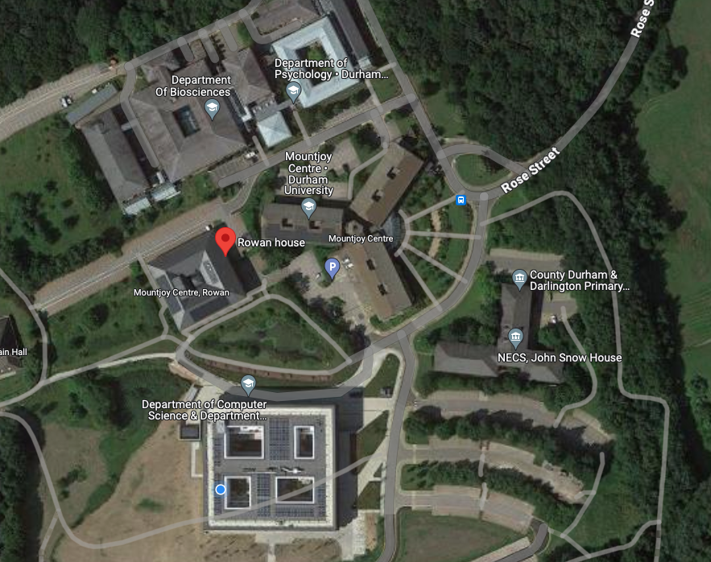

--- 
title: "Clinical Trials 4H"
author: "Rachel Oughton"
date: "`r Sys.Date()`"
site: bookdown::bookdown_site
output: 
  bookdown::gitbook:

    highlight: tango
    css: "style.css"
    config:
      toc:
        collapse: section
      bookdown:
      sharing:
        github: yes
        facebook: no
        twitter: no
  bookdown::pdf_book:
    highlight: tango
    classoption:
      - onecolumn
      - portrait
    extra_dependencies: 
      geometry: ["margin = 1in"]
    latex_engine: pdflatex
    toc: true
    keep_tex: yes
    citation_package: natbib
    df_print: kable
documentclass: book
classoption: openany
bibliography: [ct4h.bib]
biblio-style: apalike
always_allow_html: true
link-citations: yes
github-repo: rstudio/bookdown-demo
description: "These notes mirror what we'll follow in lectures for Clinical Trials 4H. If you have any questions or notice any errors, please email me (Rachel Oughton)."
---

```{r setup, include = F}
knitr::opts_chunk$set(echo=FALSE, message = FALSE, warning = FALSE)
htmltools::tagList(rmarkdown::html_dependency_font_awesome())
# This line sometimes needs commenting out to first generate the html file
options(knitr.table.format = function() {
  if (knitr::is_latex_output())
    "latex" else "pipe"
 })
```

```{r, echo=F}
library(medicaldata)
library(ggplot2)
library(gridExtra)
library(knitr)
library(kableExtra)
library(magick)
library(htmlTable)
library(magrittr)
library(rstatix)
```

# Welcome to Clinical Trials 4H! {-}

This page contains the notes for Clinical Trials IV. As we progress through the course, more will appear. You can also download the PDF version (see the icon at the top left). If you notice any typos, mistakes or places that are unclear, please do let me know!

## Practical details {-}

### Lectures {-}

Our lectures are 12 noon on Mondays and 9am on Wednesdays, all in ES231. This is in the Earth Sciences / Arthur Holmes building, which is behind (almost surrounding) the Calman Learning Centre. The door of this room is actually labelled 'Teaching Room 4'.

### Computer classes {-}

We have two 2-hour practicals for this module. They are 11am - 1pm on the Fridays of weeks 14 and 19 (2nd February and 8th March). These classes are in RH-0003. This is Rowan House, which is in Upper Mountjoy, across the pond from the MCS building. 

```{r}

```

### Assessment {-}

This module is assessed through two equally weighted pieces of coursework. The first will be assigned on Wednesday 7th February, the second on Wednesday 13th March.

There will also be some formative assignments throughout the course. More details on these to follow.

### Books {-}

The main reference for the first half of the course is @matthews2006introduction. There are a couple of copies in the Bill Bryson Library. Some other books we will make use of are @hulley2013designing, @hayes2017cluster. You shouldn't need to use any of these books, but of course you're welcome to if you want to read further.

## What to expect from this module {-}

Clinical Trials IV is somewhat different from the majority of statistics modules, because

  * It is more focussed on application than on methodology
  * It is assessed purely through coursework.
  
This means that your experience of it might be different from what you're used to

  * We will cover quite a lot of different statistical methods (drawing on most of the 1H and 2H courses, and some 3H!) but not in great depth
  * There is no pressure to memorize anything - indeed, if you really were a trial statistician, you would definitely have access to the internet, various textbooks and indeed these notes (should they prove useful!).
  * There is an emphasis on understanding which method we use and why, and what it means. Hopefully this has been the case in some of your other modules too!
  
### What I expect from you {-}

Because we will be covering quite a lot of different areas within statistics, there may be some things that you haven't seen before (or can't remember very well). I will try my best to explain them as clearly as I can, but there isn't time to go into the nuts and bolts of everything we come across. Therefore, if you do feel a bit rusty on some area, you may need to read up on that a bit, so that you're happy with it. I am very happy to suggest resources from time to time, and you're welcome to come to the office hour to talk about such things.

This is the first year this course is running, and so I would also really appreciate your feedback. I may not be able to address everything (or I may only be able to implement things for following years), but if I can act on it quickly then I will!
  


