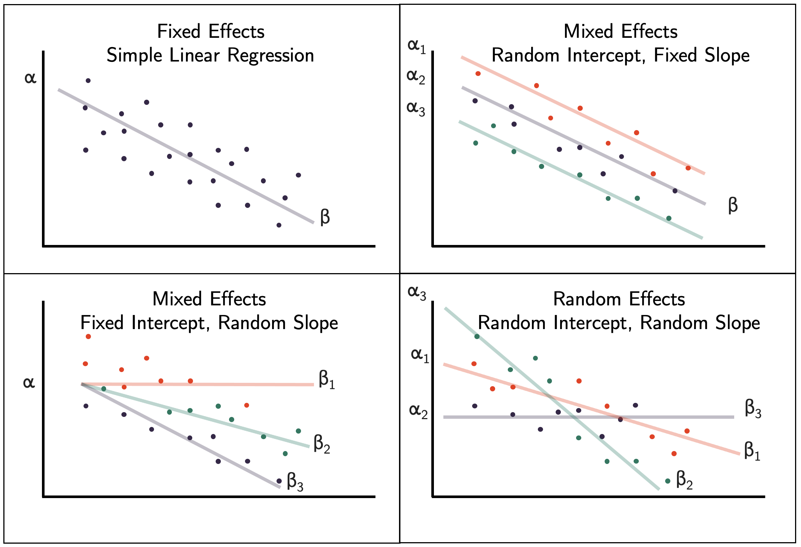

# (PART) Part III: Further designs {-}

# Cluster randomised trials {#cluster-rct}

For the trials we've been studying so far, the intervention is applied at an individual level. 

*Often realistic, for example a medicine, injection or operation*.

However, for some treatments this is not practical, eg. a new cleaning regime in operating theatres. 

*Almost impossible to implement this if different patients within the same hospital would be allocated to different cleaning styles.* 

*Logistically it would be very difficult, and there would likely be contamination as staff may be reluctant to clean an operating theatre in what might now seem an inferior way, for a control participant. In general it is very difficult (if not impossible) to implement changes in practice across healthcare systems at an individual level.* 

The solution to this is to work at the group level, rather than the individual level.

## What is a cluster RCT?

In a cluster RCT, participants within the same natural group (eg. doctor's surgery, hospital, school, classroom,...) are all allocated to the same group together. 

*This means that, in the cleaning example above, the staff at a hospital in the treatment group can be trained in the new practice, all patients at that hospital will 'receive the new treatment', and contamination between groups is minimised.*

Main issue: participants within the same group are often likely to be more similar to one another than to someone in a different group. 

We expect that each group has its own 'true' mean $\mu_k$ , which is different from the underlying population mean $\mu$, and that the cluster means are distributed with mean $\mu$ and variance $\sigma^2_b$ (more on $\sigma^2_b$ soon).

This violates one of the key assumptions we've held so far, that the data are independent, and leads us to a very important quantity called the **intracluster correlation** (ICC).

### Intracluster correlation

The ICC quantifies the relatedness of data that are clustered in groups by comparing the variance within groups by the variance between groups. 

$$ICC = \frac{\sigma^2_b}{\sigma^2_b + \sigma^2_w}, $$
where $\sigma^2_b$ is the variance **between** groups and $\sigma^2_w$ is the variance **within** groups. 

  * $\sigma_w^2=0\;\implies\;ICC=1$ and all measurements within each group are the same. At the other extreme, where             * $\sigma^2_b=0\;\implies\;ICC=0$ and all groups are independent and identically distributed.

We can estimate $\sigma_w^2$ and $\sigma_b^2$ using $s_w^2$ and $s_b^2$, which we find by decomposing the pooled variance. 

Here, $g$ is the number of groups, $n_j$ is the number of participants in group $j$ and $n$ is the total number of participants.


$$
s^2_{Tot} =  \frac{\sum\limits_{j=1}^g \sum\limits_{i=1}^{n_j}\left(x_{ij}-\bar{x}\right)^2}{n-g}\\
$$
We can split this up as

$$
\begin{aligned}
s^2_{Tot} & = \frac{1}{n-g}\sum\limits_{j=1}^g \sum\limits_{i=1}^{n_j}\left(x_{ij} - \bar{x}_j + \bar{x}_j-\bar{x}\right)^2\\
& = \frac{1}{n-g}\sum\limits_{j=1}^g \sum\limits_{i=1}^{n_j}\left[\left(x_{ij} - \bar{x}_j\right)^2 + \left(\bar{x}_j-\bar{x}\right)^2 + 2\left(x_{ij} - \bar{x}_j\right)\left(\bar{x}_j-\bar{x}\right)\right]\\
& = \frac{1}{n-g}\sum\limits_{j=1}^g \sum\limits_{i=1}^{n_j}\left[\left(x_{ij} - \bar{x}_j\right)^2 + \left(\bar{x}_j-\bar{x}\right)^2 \right]\\
&= \underbrace{\frac{1}{n-g}\sum\limits_{j=1}^g \sum\limits_{i=1}^{n_j}\left(x_{ij} - \bar{x}_j\right)^2}_{\text{Within groups}} + \underbrace{\frac{1}{n-g}\sum\limits_{j=1}^g n_j\left(\bar{x}_j - \bar{x}\right)^2}_{\text{Between groups}}
\end{aligned}
$$

:::{.example #kroger}
*We will demonstrate the ICC using a dataset that has nothing to do with clinical trials.*

The `cheese` dataset contains the price per unit and volume of sales of cheese (who knows what kind) at many Kroger stores in the US. 

We also know which city the Krogers are in, and we have data for 706 stores across 11 cities. 

*It might be reasonable to expect that if we have information about the price and sales volume for several stores within a particular city, this gives us more information about the price and volume for another store in that same city than for a store in another city.* Figure \@ref(fig:cheesedata) shows the price and volume for all stores, coloured by city.

```{r cheesedata, echo=T, fig.cap = "Price per unit and volume of sales of cheese for 706 Kroger stores."}
cheese = read.csv("kroger.csv", header=T)
cheese$city = as.factor(cheese$city)
ggplot(data=cheese, aes(x=price, y=vol, col=city)) + geom_point()
```

To calculate the ICC we define two functions, `between.var` and `within.var`, to calculate the between group and within group variance, as explained above.

<details><summary> Click to show R functions </summary>

```{r bvwvfun, echo=T}
# Firstly we define functions for the estimates
between.var = function(
    data,
    groupvec
){
  groups = levels(as.factor(groupvec))
  ng = length(groups)
  ntot = length(data)
  
  
  means = sapply(1:ng, function(i){mean(data[groupvec == groups[i]])})
  njvec = sapply(1:ng, function(i){length(data[groupvec == groups[i]])})
  mean = mean(data)
  ssqvec = sapply(1:ng, function(i){(njvec[i]*(means[i]-mean)^2)})
  sum(ssqvec)/(ntot-ng)
}

within.var = function(
    data,
    groupvec
){
  groups = levels(as.factor(groupvec))
  ng = length(groups)
  ntot = length(data)
  
  means = sapply(1:ng, function(i){mean(data[groupvec == groups[i]])})
  njvec = sapply(1:ng, function(i){length(data[groupvec == groups[i]])})


  g_sums = rep(NA, ng)
  
  for (j in 1:ng){
    data_j = data[groupvec == groups[j]]
    ssqvec = rep(NA, njvec[j])
    for (i in 1:njvec[j]){
      ssqvec[i] = (data_j[i] - means[j])^2
    }
    g_sums[j] = sum(ssqvec)/(ntot - ng)
  }
  sum(g_sums)
}

## Now we can calculate them

bvar = between.var(iris$Sepal.Length, iris$Species)
bvar
wvar = within.var(iris$Sepal.Length, iris$Species)
wvar

## And find the ICC:

icc = bvar/(bvar+wvar)
icc
```

</details>

```{r icccheese, echo=T}
wv_price = within.var(cheese$price, cheese$city)
bv_price = between.var(cheese$price, cheese$city)
icc = bv_price / (bv_price + wv_price)
icc
```


We can see that for each city we know a fair amount about the cost of cheese. But, if we had to predict the price of cheese in a new city, for which we have no data, we would have no idea what the mean for that city would be, apart from that it would come from $N\left(\mu,\;\sigma^2_b\right)$, where $\mu$ is the mean price of cheese in the overall population and $\sigma^2_b$ is the between group variance.

:::


*Estimating the ICC when planning a study is an important step, but isn't always easy.* 

*Sometimes estimated from existing data, which is likely to cover many sites.* 

*In non-medical studies like education or social interventions (where cluster RCTs are very common), it can be much more difficult because there is generally less data.* 

*Statistical studies are much newer in these areas, though they are becoming increasingly common, and even mandated by some organisations (for example the [Educational Endowment Foundation](https://educationendowmentfoundation.org.uk)).*

## Sample size

The upshot of the non-independence of the sample is that we have less information from $n$ participants in a cluster RCT than we would do for an individual-based RCT *where all the participants were independent (at least conditional on some covariates).* 

At extremes:

  * ICC=0: same as a normal RCT. 
  * ICC=1, all measurements within a cluster are identical, and to achieve the same power as with $n$ particpants in a standard RCT, we would need $n$ clusters (and their size would be irrelevant). 
  
*Obviously neither of these is ever true! In most studies, the ICC is in $\left(0,\;0.15\right)$.*
 
We will work through the sample size (and indeed most other things) for a cluster RCT in which the outcome is continuous (as in Chapter \@ref(rct-plan)), but you can equally do a cluster RCT with a binary or time-to-event outcome. 

The first step is to think about how the clustering affects the variance. An estimate of the outcome variance in the control group, ignoring the clustering, is

\begin{equation}
\hat{\sigma}^2 = \frac{\sum\limits_{j=1}^g\sum\limits_{i=1}^{n_j}\left(X_{ij} - \bar{X}\right)^2}{n-1},
(\#eq:varcrt1)
\end{equation}

where as before there are $g$ clusters, cluster $j$ has size $n_j$ and $\sum\limits_{j=1}^gn_j=n$ is the total sample size.

The mean is also calculated without reference to the clustering, so

$$\bar{X} =  \frac{\sum\limits_{j=1}^g\sum\limits_{i=1}^{n_j}X_{ij}}{n}.$$

It can be shown that the variance of the overall mean in either group is inflated by a factor of 

$$1 + \rho\left[ \frac{\sum\limits_j n_j^2}{N} - 1 \right]. $$ 

This quantity is known as the **design effect**. Notice that if all the groups are the same size $n_g = \frac{n}{g}$ then the design effect simplifies to 

$$1 + \rho\left(n_g - 1\right).$$
We will assume from now on that this is the case.

#### A formula for sample size {#ss-crt}

Now that we know $\operatorname{E}\left(\hat{\sigma}^2\right)$ we can adapt our sample size formula from Section \@ref(sec-ssformulacont). For an individual-level RCT with a continuous outcome, we had

\begin{equation}
n = \frac{2\sigma^2\left(z_{\beta} + z_{\alpha/2}\right)^2}{\tau^2_M}, 
(\#eq:ss1)
\end{equation}

and the reason we were able to do this was because the variance of the treatment effect estimate was $\sigma^2/n$. 
For a cluster RCT, the variance of the treatment effect is 

\begin{equation}
\frac{\sigma^2}{n} \left[1 + \rho\left(\frac{\sum\limits_{j=1}^g n_j}{n}-1\right)\right]
(\#eq:varte1)
\end{equation}

At the planning stage of a cluster RCT we are unlikely to know the size of each cluster, so usually specify a [conservative] average cluster size $n_g$.

*each individual involved will usually need to give their consent, so knowing the size of the hospital / GP surgery / class is not enough.* 

In this case, the variance of the treatment effect in Equation \@ref(eq:varte1) becomes

\begin{equation}
\frac{\sigma^2}{n} \left[1 + \rho\left(n_g-1\right)\right] .
(\#eq:varte2)
\end{equation}

Equation \@ref(eq:varte2) can be combined with Equation \@ref(eq:ss1) to give the sample size formula for a cluster RCT:

$$n = \frac{2\sigma^2\left[1 + \rho\left(n_g-1\right)\right]\left(z_{\beta} + z_{\alpha/2}\right)^2}{\tau^2_M}.
 $$
 Since $n=n_gg$, this can be rearranged to find the number of clusters of a given size needed, or the size of cluster if a given number of clusters is to be used.
 
*The sample size (and therefore the real power of the study) depends on two additional quantities that are generally beyond our control, and possibly knowledge: ICC and $n_g$. It is therefore sensible to conduct some sensitivity analysis, with several scenarios of ICC and $n_g$, to see what the implications are for the power of the study if things don't quite go to plan.*
 
:::{.example}
This is something I wrote for an education study I'm involved in (funded by the EEF) where the treatment is a particular way of engaging 2 year olds in conversation. The outcome variable is each child's score on the British Picture Vocabulary Scale (BPVS), a test aimed at 3 - 16 year olds designed to assess each child's vocabulary. We needed to recruit some number of nurseries, but had very little information about the IIC (notice that the age in our study is outside the intended range of the BPVS test!). 

To help the rest of the evaluation team understand the sensitivity of the power of the study to various quantities, I designed [this dashboard](https://racheloughton.shinyapps.io/sample_size/), so that they could play around with the variables and see the effect.

As well as giving the sample size for a simple t-test (as we've done above) it also shows the size for a random effects model (similar to ANCOVA, more on this soon), which is why the baseline-outcome correlation (about which we also know very little!) is included.

The plot shows the minimum detectable effect size (MDES, or $\tau_M$, in SD units), since the evaluation team wanted to know what size of effect we could find with our desired power.

:::

## Allocation

In a cluster RCT, everyone within a particular cluster will be in the same group ($T$ or $C$). Therefore, the allocation needs to be performed at the cluster level, rather than at the individual level *as we did in Chapter \@ref(alloc).*

*In theory we could use any of the first few methods we learned (simple random sampling, random permuted blocks, biased coin, urn design) to allocate the clusters. However, there are often relatively few clusters, and so the potential for imbalance in terms of the nature of the clusters would be rather high. This means we are more likely to use a stratified method or minimisation.*

In terms of prognostic factors, there are now two levels: cluster level and individual level. 

Eg, with GP practices as clusters:

  * cluster-level covariates: size of the practice, rural or urban, the IMB (index of mass deprivation) ... *It would be sensible to make sure there was balance in each of these in the allocation.* 
  * Could include aggregates of individual-level characteristics: mean age, or proportion of people with a particular condition, ... *(especially if the study relates to a particular condition).*

However, a key feature of cluster RCTs means that in fact some different, and perhaps more effective, allocation methods are open to us.

### Allocating everyone at once

The methods we've covered so far assume that participants are recruited sequentially, and begin the intervention at different points in time. When allocating participant $n$, we only know the allocation for participants $1,\ldots,n-1$. 

*It is very likely that we don't know the details of the following participants, in particular their values of any prognostic variables. This makes sense in many medical settings, where a patient would want to begin treatment as soon as possible, and there may be a limited number of patients with particular criteria at any one time.*

However, cluster RCTs rarely deal with urgent conditions (at least in the sense of administering a direct treatment), and so the procedure is usually that the settings (the clusters) are recruited over some recruitment period and all begin the intervention at the same time. 

This means that at the point of allocation, the details of all settings involved are known.
There are a couple of proposals for how to deal with allocation in this scenario, and we will look at one now. 

### Covariate constrained randomization

This method is proposed in @dickinson2015pragmatic, and implemented in the R package `cvcrand`. 
*We'll review the key points of the method, but if you're interested you can find the details in the article.*

*Baseline information must be available for all settings, for any covariate thought to be potentially important. These can be setting-level variables or aggregates of individual-level variables. Once all this data has been collected, the randomisation procedure is as follows.*

Allocation procedure:

  1. Generate all possible allocations of the clusters into two arms ($T$ and $C$). 
  2. Rule out all allocations that don't achieve the desired balance criteria to leave **optimal set**. 
  3. Choose one allocation at random from the optimal set
  
Balance criteria:

  * Factor covariates: eg. want groups C and T to have same number (or close) of rural GP practices
  * Continuous covariates: standardised (to mean 0, SD 1) and used to calculate a 'Balance score'

## Analysing a cluster RCT

*As with the other stages of a cluster RCT, to conduct an effective and accurate analysis we need to take into account the clustered nature of the data. There are several ways to do this, and we will whizz through the main ones now.*

:::{.example}
Data from an educational trial, contained in `crtData` in the package `eefAnalytics`, shown in Figure \@ref(fig:crtboxplots) . The dataset contains 22 schools and 265 pupils in total. Each school was assigned to either `1` (group $T$) or `0` (group $C$). Each pupil took a test before the trial, and again at the end of the trial. 
We also know the percentage attendance for each pupil. We will use this data to demonstrate each method.

```{r eeftab, fig.cap = "The eefAnalytics dataset."}
crt_df = crtData[ ,-c(5,6)]
crt_df$School = as.factor(crt_df$School)
crt_df$Intervention = as.factor(crt_df$Intervention)
str(crt_df)
```

```{r crtboxplots, echo=T, fig.cap = "Box plots of the outcome Posttest for each school, coloured by Intervention."}
ggplot(data=crt_df, aes(y=Posttest, fill=Intervention, group = School)) + geom_boxplot()

```

:::

### At the cluster level

Idea: aggregate data to the cluster level, so that for each cluster (school, in our example), there is effectively one data point. 

Advantages:

  * Fast
  * Simple methodology (eg. t-test)
  
Disadvantages:

  * Loses a lot of information
  * Not appropriate if group sizes vary (the larger group $j$, the smaller the SE of $\bar{x}_j$)

*There are methods designed to account for this, such as the weighted t-test, but these methods are generally inefficient and less robust. These methods are generally thought to be appropriate for fewer than 15-20 clusters per treatment arm.*

*One possibility for our trial would be to collect the mean and SD of scores within each school, and perform a t-test to find out if there is a significant difference between the intervention and control arms.*

*If we wanted to find out whether this depended on, say, gender, we could split the data set and perform seperate t-tests for the different gender groups.* 

*This has the advantage that it is simple to implement, but the disadvantage that it is difficult to take into account covariates (apart from in the simple way discussed for eg. gender). With a small study, it is likely that there is some imbalance in the design in terms of covariates.*

The required sample size for this option would be

$$
g = \frac{2 \sigma^2 \left[1+ \left(n_g-1\right)\rho_{icc}\right]}{n_g\tau^2_M}\left(z_{\beta} + z_{\frac{1}{2}\alpha}\right)^2,
$$
where $n_g$ is the average cluster size and $g$ is the number of clusters per treatment arm. This is the value we worked out in Section \@ref(ss-crt)

:::{.example}
We can perform this analysis on our schools data. The first step is to calculate the difference between `Posttest` and `Pretest` for each pupil (we could also use just `Posttest`).

```{r, echo=T}
crt_df$diff = crt_df$Posttest - crt_df$Prettest
```

We can then aggregate this to find the mean of `diff` for each school, shown in Table \@ref(tab:eefsum):

```{r eefsum}
crt_summ = crt_df %>%
  group_by(School) %>%
  summarise(MeanDiff = mean(diff), ng = n(), Group = unique(Intervention))
crt_summ$Group = as.factor(crt_summ$Group)
knitr::kable(crt_summ[1:10,], booktabs = T, caption = "EEF data with difference calculated (first 10 rows).")

```
We can also visualise the mean differences by group

```{r crt1bp, fig.cap = "Boxplots of the mean differences for each trial arm", fig.height=2}
ggplot(data=crt_summ, aes(x=MeanDiff, fill=Group)) + geom_boxplot()
```

From Figure \@ref(fig:crt1bp) it certainly looks likely that a significant difference will be found.

```{r, echo=T}
t.test(
  x=crt_summ$MeanDiff[crt_summ$Group==0],
  y=crt_summ$MeanDiff[crt_summ$Group==1],
  alternative = "two.sided",
  paired = F,
  var.equal=F
)
```
:::

*This is fairly easy to implement, but it seems rather unsatisfactory. It's also probably not entirely appropriate because the group sizes vary from one (!) to 33. What we need is a linear (in the continuous outcome case at least) model that takes into account the covariates, and makes the most of the available data.*

### At the individual level: mixed effects models

**Mixed effects model** or **random effects model**, or **multilevel models**. 

§used when it cannot be assumed that the outputs are all independent of one another. 

*In the cluster randomized trial setting, this is because outcomes for participants within the same cluster can be expected to be more highly correlated than outcomes for patients from different clusters, but we will see examples of other designs in the next lecture.*

To understand mixed effects models, we need to think about the difference between **fixed effects** and **random effects**. These are two different types of factor variables.

#### Fixed effects {-}

These are the sorts of factor variables we're used to dealing with in linear models: 

  * we don't assume any relationship between the levels
  * we are generally interested in comparing the groups or categories represented by the fixed effect factors. 
  
*We've seen these throughout the course, most notably with the treatment group variable $G_i$, but also with things like smoking history, sex, disease details.* 

*When conducting a clinical trial, we're likely to try to include participants with all levels of the fixed effects we're interested in, so that we can make inferences about the effect of the different levels of those effects.* 

#### Random effects {-}

*Random effects are probably just as common in real life, but we haven't seen them yet.* 

Factor variables that we think of as being drawn from some underlying model or distribution. For example, this could be GP surgery or school class, or an individual. 

We expect each GP surgery / school class / individual to behave slightly differently (depending on the extent of the intracluster correlation) but to behave as though from some overall distribution. 

*Unlike fixed effects, random effects are generally things we aren't specifically interested in understanding the effect of, but we want to account for the variation they bring.*

*We're also unable to include all levels of the random effect in our study - for example, a study looking at the effect of an intervention in schools will involve perhaps 50 schools, but we want to apply to results to all schools in the UK (say).* 

We therefore assume that the schools are drawn from some normal distribution (in terms of the outcome we're interested in), and that therefore all the schools we haven't included also belong to this distribution. 

In Example \@ref(exm:kroger) we aren't trying to compare different cities, and we certainly don't have data for Kroger stores in all cities, but we're assuming that the mean cheese price $\mu_{\text{city}_i}$ in the different cities is drawn from $N\left(\mu,\,\sigma^2_B\right)$, and that within each city the cheese price is drawn from $N\left(\mu_{\text{city}_i},\;\sigma^2_W\right)$.

*Including random effects allows us to account for the fact that some schools might be in general a bit better / worse performing, or some individuals might be a bit more / less healthy, because of natural variation. We will see more examples of the use of random effects in the next lecture.*


#### The mixed effects model {-}

Mixed effects models allow us to combine fixed effects and random effects. 

*We'll look at them next lecture too, because they are useful for many more situations than cluster RCTs, but this is as good a place as any to start!*

\begin{equation}
x_{ijk} = \alpha + \beta G_i + \sum\limits_l \gamma_l z_{ijkl} + u_{ij} + v_{ijk}
(\#eq:remodel)
\end{equation}

where

  * $x_{ijk}$ is the outcome for the $k$-th individual in the $j$-th cluster in the $i$-th treatment arm (usually $i=0$ is the control arm and $i=1$ is the intervention arm)
  * $\alpha$ is the intercept of the model
  * $\beta$ is the intervention effect, and $G_i$ the group indicator variable (0 for group $C$, 1 for group $T$). Our null hypothesis is that $\beta$ is also zero)
  * The $z_{ijkl}$ are $L$ different individual level covariates that we wish to take into account, and the $\gamma_l$ are the estimated coefficients.
  * $u_{ij}$ is a random effect relating to the $j$-th cluster in the $i$-th treatment arm. This is the term that accounts for the between-cluster variation. We assume $u_{ij}$ is normally distributed with mean 0 and variance $\sigma^2_B$ (the between-cluster variance).
  * $v_{ijk}$ is a random effect relating to the $k$-th individual in the cluster (ie. an individual level random error term), assumed normally distributed with mean 0 and variance $\sigma^2_W$ (the within-cluster variance).

*The part of the model that makes this particularly suitable to a cluster randomized trial is $u_{ij}$. Notice that this has no $k$ index, and is therefore the same for all participants within a particular cluster.*

*With a random effects model we can take into account the effects of individual-level covariates and also the clustered design of the data.* 

Approximately, our sample size requirements are

$$
k = \frac{2 \sigma^2 \left[1+ \left(m-1\right)\rho_{icc}\right]\left(1-\rho^2\right) }{m\tau^2_M}\left(z_{\beta} + z_{\frac{1}{2}\alpha}\right)^2.
$$

*Broadly this follows on from the logic we used to show the reduction in variance from the ANCOVA model in Section \@ref(ancova-var), and you'll notice that the factor of $1-\rho^2$ is the same. The details for cluster randomized trials are given in @teerenstra2012simple.*

This is the 'Random effects model' line in [the shiny dashboard](https://racheloughton.shinyapps.io/sample_size/?_ga=2.190583720.2013007057.1679308387-1261352122.1678702192).)

*The random effects model is more suitable when there are more than around 15-20 clusters in each arm.*


::: {.example}

We'll now fit a random effects model to the `crtData` dataset from `eefAnalytics`. A good starting point is to plot the data with this in mind, to see what we might expect.

```{r eefplot2, echo=F, fig.cap = "Posttest against Prettest, coloured by Intervention"}
ggplot(data = crt_df) + aes(x=Prettest, y=Posttest, col = Intervention) + geom_point()
```

From Figure \@ref(fig:eefplot2) it appears there might be a positive relationship between `Prettest` and `Posttest`, and also that the `Posttest` scores might be higher in the intervention group.

We'll do this using the R package `lme4`. The function to specify a linear mixed effects model is called `lmer`, and works very similarly to `lm`. The term `(1|School)` tells R that the variable `School` should be treated as a random effect, not a fixed effect.

```{r, echo=T}
library(lme4) 
library(sjPlot)
lmer_eef1 = lmer(Posttest ~ Prettest + Intervention + (1|School), data=crt_df )
```

The package `sjPlot` contains functions to work with mixed effect model objects, for example `plot_model`

```{r lmerplot1, echo=T, fig.cap = "CIs for the model coefficients for the mixed effects model of crtData."}
sjPlot::plot_model(lmer_eef1)
```

and `tab_model`

```{r lmertab1,  fig.cap = "Summary table of model - note that this is different in PDF and HTML. The HTML has more information!"}
if(is_html_output()){
  sjPlot::tab_model(lmer_eef1)
} else {
  summary(lmer_eef1)
}
```

Perhaps unsurprisingly, the coefficient of the baseline test score is very significant, and the intervention also has a significant effect. This function also estimates the intracluster correlation, which we see is 0.28.

:::

There are various different ways we can include random effects in the model, as shown in Figure \@ref(fig:raneffmodels). In our EEF data example we have used a fixed slope and fixed intercept. 

```{r raneffmodels, fig.cap = "Different ways of including random effects in a mixed effects model."}

```

The mixed effects model can be extended to a **generalized mixed effects model**, which is akin to a generalized linear model. For example, with a binary outcome $X_{ijk}$ we can adopt the model

$$
\operatorname{logit}\left(\pi_{ijk}\right) = \alpha + \beta G_i + \sum\limits_l \gamma_l z_{ijkl} + u_{ij} + v_{ijk}.
$$

We will look in the next lecture at some more trial designs for which mixed effects models are useful. 